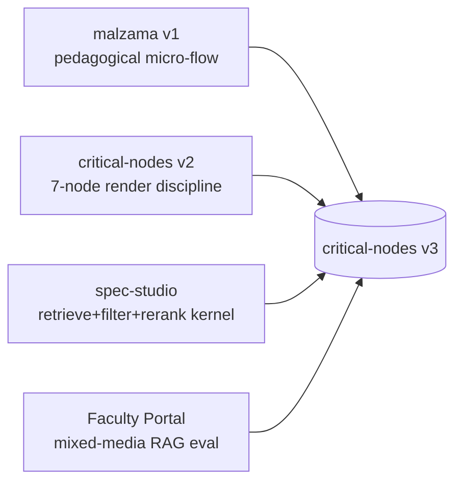

## What this doc is

One new file at the workspace root: [`critical-nodes-v3.md`](critical-nodes-v3.md). The single source of truth for v3 — architecture, data model, every route, every node, every AI prompt, every fallback, every acceptance criterion. Paired sibling to [`malzama-investigation.md`](malzama-investigation.md) and [`spec-studio-investigation.md`](spec-studio-investigation.md). Markdown only — zero code changes in this turn.

## Locked-in v3 shape (from the Q&A)

- Extend [`critical-nodes`](.) in place; do not start a new repo.
- Student lifecycle is a **two-stage funnel** plus a final cross-stage audit:
  - **Stage A — Pedagogy** (malzama lineage): Concept phase → Zoning phase. Each phase runs `Orient → Sketch → Think → Act → Reflect → Synthesis`.
  - **Stage B — Visualization** (existing v2 critical-nodes verbatim, now RAG-grounded): `Intent → Visual Priority → References → Geometry → Material/Light → Prompt → Audit`.
  - **Final — Alignment Audit**: cross-stage. Compare the render against Stage A's concept statement, Zoning logic, and the prompt assembly.
- Vercel-deployable: Neon Postgres + pgvector (Marketplace), Vercel Blob for uploads, Clerk for `faculty` + `student` roles.
- Single big spec doc (no separate roadmap file).

## Three lineages → one product

## Mega-spec outline (16 sections)

Section list below mirrors the two investigation docs in depth and tone. Every claim will trace back to a real source file in [`src/`](src/), the spec-studio kernel, or the malzama investigation. Mermaid diagrams used for the lifecycle and the RAG flow.

1. **Vision & guiding principles**
   - One paragraph of "what v3 is": the entire lifecycle of design for the student, faculty-grounded, reflection-first.
   - Five non-negotiable principles ported from the investigations:
     - 3-stage retrieve → filter → rerank around every AI moment (spec-studio).
     - Strict-JSON response schemas + always-on graceful fallback (spec-studio).
     - Academic citation + visual + 1-line insight triplet as the core teaching device (malzama).
     - Reflection-first: every AI surface is paired with a student-reflection moment (malzama).
     - No `NEXT_PUBLIC_*` API keys — every model call is server-side (explicit fix to the malzama anti-pattern).

2. **Tech stack & deployment**
   - Next.js 16 App Router + React 19 + Tailwind v4 (already in [`package.json`](package.json)).
   - **Storage**: Neon Postgres + pgvector via Vercel Marketplace; existing v2 [`src/lib/store.ts`](src/lib/store.ts) localStorage path kept only for local sandbox.
   - **Files**: Vercel Blob — uploads (faculty PDFs, student sketches, renders).
   - **Auth**: Clerk via Vercel Marketplace — middleware-protected route groups, `faculty` vs `student` role on the JWT.
   - **AI**: `@google/genai` already installed; Gemini 2.5 Flash (mentor, eval), Gemini 2.5 Pro multimodal (audit, reference deconstruction), Nano Banana 2/Pro for image gen (already wired in [`src/lib/gemini.ts`](src/lib/gemini.ts)).
   - **Embeddings**: Jina CLIP v2 (1024d, image+text shared space) — same pattern as [`spec-studio/lib/embed.ts`](../spec-studio/lib/embed.ts) but with `unpdf`/`pdfjs-dist` for PDF rasterization upstream.
   - **AI Gateway** flagged as optional behind a feature flag — keep direct provider calls in v3 MVP.
   - Use the `vercel.ts` config pattern (per current platform guidance) instead of `vercel.json`.

3. **The three-lineage glue table**
   - Side-by-side mapping of: malzama feature → v2 critical-node → faculty/RAG hook → v3 home in the new codebase.
   - Explicit `KEEP / EVOLVE / DELETE` column. E.g.: `KEEP` Reflect→ AI mentor pattern; `EVOLVE` open-OpenAI key call → server route grounded via RAG; `DELETE` `NEXT_PUBLIC_OPENAI_API_KEY`.

4. **Routes & navigation**
   - **Public**: `/`, `/sign-in`, `/sign-up`.
   - **Faculty** (route group `(faculty)`): `/faculty`, `/faculty/courses`, `/faculty/courses/[id]`, `/faculty/courses/[id]/sources`, `/faculty/courses/[id]/sources/[sourceId]`, `/faculty/courses/[id]/assignments`, `/faculty/courses/[id]/assignments/[assignmentId]`, `/faculty/courses/[id]/cohort`, `/faculty/courses/[id]/evaluations/[evalId]`.
   - **Student** (route group `(student)`): `/studio` (session list), `/studio/[sessionId]` (Living Canvas), `/studio/[sessionId]/concept`, `/studio/[sessionId]/zoning`, `/studio/[sessionId]/visualize` (the existing 7 nodes), `/studio/[sessionId]/audit`, `/studio/[sessionId]/end`.
   - **API**: `/api/rag/{retrieve,rerank}`, `/api/ingest/{pdf,slides,image}`, `/api/mentor`, `/api/render`, `/api/evaluate`, `/api/sources/[id]`, `/api/sessions/[id]/{state,export}`.
   - All `(student)` and `(faculty)` groups gated by Clerk middleware in [`middleware.ts`](middleware.ts) (new file).
   - Existing v2 page lives on as `/studio/[sessionId]/visualize` — the **same** [`src/components/living-canvas.tsx`](src/components/living-canvas.tsx) component, just nested under a session.

5. **Data model (Postgres DDL — verbatim block in the doc)**
   - `users(id, clerk_id UNIQUE, role faculty|student, created_at)`
   - `courses(id, owner_id→users, title, slug UNIQUE, code, created_at)`
   - `enrollments(course_id, student_id, role, invited_at, joined_at)`
   - `sources(id, course_id, kind pdf|pptx|epub|image|link, title, blob_url, mime, page_count, ingest_status, ingested_at, uploaded_by, raw_meta jsonb)`
   - `source_chunks(id, source_id, ordinal, kind text|image|table, page, bbox jsonb, content_text, image_blob_url, parent_chunk_id, tokens, created_at)` — generalizes spec-studio's `products` table.
   - `source_chunk_vec(chunk_id PK→source_chunks, embedding vector(1024))` — pgvector analogue of spec-studio's `product_vec` vec0 table; `ivfflat` cosine index.
   - `assignments(id, course_id, title, rubric jsonb, scope_source_ids int[], scope_chunk_ids bigint[] NULL, scope_nodes text[], due_at, published_at)`.
   - `sessions(id, student_id, course_id, assignment_id NULL, status, started_at, ended_at)`.
   - `session_node_state(session_id, node_id, data jsonb, mentor_feedback jsonb, updated_at, PK(session_id,node_id))` — `data` holds either malzama-phase shape or the existing v2 `IntentData`/`VisualPriorityData`/etc. from [`src/lib/store.ts`](src/lib/store.ts).
   - `mentor_messages(id, session_id, node_id, role, content, citations jsonb, model, ms, created_at)` — every AI moment logged with chunk citations.
   - `renders(id, session_id, prompt, model, aspect, blob_url, thumb_blob_url, created_at)`.
   - `evaluations(id, session_id, assignment_id, rubric_scores jsonb, narrative, citations jsonb, model, created_at)`.
   - `events(id, actor_id, kind, payload jsonb, created_at)` — audit log.
   - DDL snippets shown inline; migrations managed via Drizzle (recommended) — folder `drizzle/`.

6. **Student lifecycle in full (every screen, every branch)**
   - **Stage A — Pedagogy (malzama lineage, ported verbatim)**
     - Each phase is a state machine of `orient → sketch → think → act → reflect → synthesis → end`.
     - Phase content (questions, options, driver, compareQuestion, missions, reflectChoices, etc.) lives in TypeScript modules `src/lib/phases/concept.ts` and `src/lib/phases/zoning.ts` — direct port of the JSON dumps in §4.1 and §4.2 of [`malzama-investigation.md`](malzama-investigation.md), with `referenceId` now pointing into `sources` (faculty-provided where assigned, falling back to `src/config/references-academic.json` for the five canon books).
     - The 1.35s `response-reveal` between steps, the magic keys `97/98/99` for visual-recall/compare/driver, the dual-mode Act (single output vs missions) — all preserved.
     - Synthesis screen runs the *template-first, AI-refine-after* pattern but with two new hooks: (a) AI call is server-side via `/api/mentor`; (b) refinement is grounded against the assignment's scoped chunks via the new RAG kernel.
   - **Stage B — Visualization (existing v2 in place)**
     - Reuses [`src/components/intent-form.tsx`](src/components/intent-form.tsx), [`src/components/visual-priority-locator.tsx`](src/components/visual-priority-locator.tsx), [`src/components/reference-deconstruction.tsx`](src/components/reference-deconstruction.tsx), [`src/components/geometry-validation.tsx`](src/components/geometry-validation.tsx), [`src/components/materials-light-validation.tsx`](src/components/materials-light-validation.tsx), [`src/components/prompt-architecture.tsx`](src/components/prompt-architecture.tsx), [`src/components/alignment-audit.tsx`](src/components/alignment-audit.tsx).
     - Behind each node's "AI advisory" hook (currently `src/lib/ai-advisory.ts`), inject a RAG pre-step: retrieve top-K chunks from `assignment.scope_chunk_ids` (or course-wide if no assignment), then ground the existing Gemini prompt with those chunks + citations.
     - Living Canvas progress badges now show grounding state (a small `cited n sources` chip).
   - **Final — Alignment Audit (new cross-stage)**
     - Three-panel layout: declared intent (Stage A) | constructed prompt (Stage B) | actual render.
     - AI compares all three (Gemini 2.5 Pro multimodal). Output: alignment / drift / contradiction items, each linked to its source chunk + node where it originated.
   - Full mermaid lifecycle diagram showing both stages, the malzama micro-flow inside each Stage A phase, and the audit join.

7. **RAG kernel — ported & evolved from spec-studio**
   - Module location: `src/lib/rag/` with `db.ts`, `embed.ts`, `rerank.ts`, `types.ts`, `chunks.ts`, `ingest/{pdf,pptx,image,link}.ts`.
   - **Pipeline** (mirrors [`spec-studio/lib`](../spec-studio/lib) one-to-one):
     1. `embedQuery(text | image)` via Jina CLIP v2 (server-side, key never exposed).
     2. `retrieveChunks(qVec, { courseId, sourceIds, k=24, overscan=k*4 })` — pgvector ANN search with overscan-then-filter pattern from [`spec-studio/lib/db.ts`](../spec-studio/lib/db.ts).
     3. Optional scope filter by `assignment.scope_chunk_ids`.
     4. `rerank(query, chunks, { topK=8 })` — Gemini 2.5 Flash multimodal with strict JSON schema + always-fallback identity ordering, lifted from [`spec-studio/lib/rerank.ts`](../spec-studio/lib/rerank.ts).
     5. `ground(answer, citedChunks)` — every model call gets cited chunks rolled into the system prompt, and the response schema forces the model to emit `citations: chunk_id[]`.
   - Hybrid retrieval: keyword + vector union for short queries (Postgres `tsvector` on `content_text` ∪ pgvector top-k), de-duplicated by `chunk_id`.
   - Carries forward spec-studio's `thumbnailUrl` token-aware-ingestion idea: PDF pages rasterized to 512px JPEGs before embedding.
   - Offline smoke test at `scripts/smoke-rag.ts` — port of [`spec-studio/scripts/smoke-test.ts`](../spec-studio/scripts/smoke-test.ts): deterministic seeded random vectors prove retrieve/rerank/fallback contracts without external APIs.

8. **Mixed-media ingestion — the meeting-minutes challenge solved end-to-end**
   - Subsection per source kind. For each: parse → chunk → embed → upsert.
   - **PDF (`ingest/pdf.ts`)**: `unpdf` (Vercel-friendly, no native deps) for text + per-page raster. Each page produces: (a) one or more `text` chunks (heading-aware splitter, ~400-600 tokens, 80-token overlap); (b) one `image` chunk per page (512px JPEG to Vercel Blob, CLIP-embedded); (c) figure-detection pass via Gemini 2.5 Pro multimodal which returns `figures: [{ bbox, caption_guess }]` — each becomes its own `image` chunk with `parent_chunk_id` linking back to the page.
   - **PPTX (`ingest/pptx.ts`)**: Use Gemini Files API to convert PPTX → PDF, then reuse the PDF path. Each slide = one page = one image chunk + text chunks for slide titles/bullets parsed from the source.
   - **EPUB / book excerpts**: extract via `epub2` (or paste-text path for excerpts), chunk text only — no per-page raster.
   - **Image (single file)**: embed directly with Jina CLIP v2.
   - **Link**: fetch HTML, Mozilla Readability for main text + `` extraction.
   - Ingestion runs as a Vercel function (`runtime = "nodejs"`, `maxDuration: 300`), but heavy PDFs are background-processed via Vercel Queues (or a simple `ingest_status` poll if Queues feel like overkill for MVP — note both options).
   - Progress is streamed back to faculty UI via Server-Sent Events on `/api/ingest/[id]/stream`.

9. **AI integration — every prompt mapped (the table)**
   - One subsection per AI moment with: trigger, model, temperature, response schema, grounding (RAG yes/no + scope), failure-fallback, citation requirement, exact prompt sketch.
   - The eleven AI moments:
     1. **Concept Statement refinement** (Stage A Synthesis) — Gemini 2.5 Flash, RAG-grounded against assignment scope; falls back to malzama's template `H()` form on any error (preserves the doc's `template-first, AI-refine-after` pattern).
     2. **Mentor feedback** (end of every Reflect step) — Gemini 2.5 Flash, RAG-grounded, 1-2 sentences max, fallback to null (no mentor card).
     3. **Sketch evaluation** (Stage A Sketch + Stage B Visual Priority) — Gemini 2.5 Flash multimodal, ungrounded (about the student's own image).
     4. **Reference Deconstruction analysis** (Stage B node 3) — Gemini 2.5 Pro multimodal, grounded against faculty image library + scoped academic references.
     5. **Geometry validation advisory** (Stage B node 4) — Gemini 2.5 Flash multimodal.
     6. **Material-Light interaction check** (Stage B node 5) — Gemini 2.5 Flash, RAG-grounded.
     7. **Prompt Architecture suggestions** (Stage B node 6) — Gemini 2.5 Flash, RAG-grounded.
     8. **Render generation** — Nano Banana 2 / Pro (already wired).
     9. **Alignment Audit** (Final stage) — Gemini 2.5 Pro multimodal, all-grounded; emits a structured `alignment | drift | contradiction` JSON.
     10. **Faculty: question generation from sources** — Gemini 2.5 Pro, grounded against a specific chunk-set, emits an array of `{ question, expected_evidence: chunk_id[], rubric_tags[] }`.
     11. **Faculty: assignment evaluation of student submission** — Gemini 2.5 Pro multimodal, grounded against the assignment's scoped chunks + the student's full session state, emits `rubric_scores + narrative + citations[]`.
   - Every prompt body shown verbatim; every response schema given as a TypeScript `Type.OBJECT` literal (Gemini `responseSchema` pattern from [`spec-studio/lib/rerank.ts`](../spec-studio/lib/rerank.ts)).

10. **Faculty portal — every screen**
    - **Course list** (`/faculty`): grid of cards; CTA "New course".
    - **Course detail** (`/faculty/courses/[id]`): title, code, enrollment count, source count, assignment count, recent activity.
    - **Sources** (`/faculty/courses/[id]/sources`): drop-zone (multi-file PDF/PPTX/EPUB/image), per-source ingestion progress bar (SSE), processed chunk count, page thumbnails.
    - **Source viewer** (`/faculty/courses/[id]/sources/[sourceId]`): split view — page thumbnails on left, chunk list on right (text chunks excerpted, image chunks shown as thumbnails). Each chunk has a "use in assignment" checkbox.
    - **Assignments** (`/faculty/courses/[id]/assignments`): list with status (draft/published), due date, # submissions.
    - **Assignment composer** (`/faculty/courses/[id]/assignments/[id]`): pick scope (whole source / specific chunks), pick required nodes/phases (Stage A only / Stage B only / both / specific subset), write rubric (free-text + tagged criteria), preview AI-generated questions before publishing.
    - **Cohort progress** (`/faculty/courses/[id]/cohort`): table of student × node × status (not started / in progress / submitted / evaluated). Click cell → student session view.
    - **Evaluation review** (`/faculty/courses/[id]/evaluations/[evalId]`): AI's evaluation + citations linking back to chunks; faculty can override scores and add comments.

11. **Auth & roles**
    - Clerk via Vercel Marketplace (auto-provisioned env vars).
    - JWT carries `role: faculty | student`; on sign-up faculty enter an instructor code, students are invited via course invite link.
    - Middleware in [`middleware.ts`](middleware.ts) gates `(faculty)` and `(student)` route groups separately.
    - All API routes use Clerk `auth()` server-side; row-level scoping by `user_id` enforced in DB queries.
    - No tenant orgs in v3 (deferred to multi-tenant SaaS layer).

12. **Storage strategy**
    - Vercel Blob (`@vercel/blob`) for: faculty PDFs, slide decks, EPUBs; per-page rendered images for chunks; student sketches; generated render images.
    - Blob URLs stored on `sources.blob_url`, `source_chunks.image_blob_url`, `renders.blob_url`.
    - Postgres for everything else.
    - Migrations via Drizzle (`drizzle/migrations/*.sql`).

13. **Migration from v2 (no-data-loss)**
    - Detect localStorage v2 sessions on first login; offer one-click `Import v2 sessions` action — converts to `sessions` + `session_node_state` rows under the new student account.
    - v2 `IntentData`, `VisualPriorityData`, `ReferenceBreakdown[]`, etc. become the canonical `data` jsonb shape for nodes `intent`, `visualPriority`, etc. in `session_node_state` — zero shape change.
    - All v2 components reused verbatim — they bind to the same data shape they bind to today; only the persistence layer is swapped via a new `useSessionState(nodeId)` hook that calls `/api/sessions/[id]/state` instead of localStorage.

14. **Acceptance criteria & smoke tests**
    - **Pedagogy smoke**: student completes a Concept phase end-to-end (orient → sketch → think → act → reflect → synthesis) with at least one mentor feedback message that includes a citation chip linking to a faculty source chunk. Refresh = state survives (Postgres-backed).
    - **Visualization smoke**: existing 7-node flow still functions; each AI advisory now shows a `cited n sources` chip and source citations on hover.
    - **Faculty smoke**: faculty uploads a 20-page PDF + a 30-slide PPTX → both finish ingestion within 5 min → chunk count is non-zero → assignment composer can pick scope → student in same course sees the new assignment.
    - **RAG smoke** (`scripts/smoke-rag.ts`): deterministic seeded random vectors prove (1) exact match ranks #1, (2) jittered match in top-3, (3) scope filter holds with zero leakage, (4) rerank falls back to identity ordering without `GEMINI_API_KEY`, (5) grounded answers always include `citations: chunk_id[]` (or empty array on fallback).
    - **Auth smoke**: faculty cannot access `/studio/*`; student cannot access `/faculty/*`; middleware redirects 401 → `/sign-in`.

15. **Security & failure modes (what NOT to repeat)**
    - **No `NEXT_PUBLIC_*` keys**. Every AI call routed through `/api/*` server routes — explicit fix to malzama's exposed `NEXT_PUBLIC_OPENAI_API_KEY`.
    - Rate-limit `/api/mentor` and `/api/render` per user per minute (Upstash Redis via Vercel Marketplace, or per-deployment in-memory for MVP).
    - Embedding rate-limit posture carried over from [`spec-studio/lib/embed.ts`](../spec-studio/lib/embed.ts): batched, polite delays, 65s cooldown on 429.
    - Every Gemini call has a graceful fallback (identity ordering for re-rank, template-only for synthesis, `null` for mentor feedback) — never a hard failure surfaced to the student. Mirrors the discipline documented in §7 of [`spec-studio-investigation.md`](spec-studio-investigation.md).
    - Citations are required in response schemas — model cannot pretend it grounded if it didn't.
    - File upload size cap (12 MB images / 50 MB PDFs / 80 MB PPTX), MIME-checked server-side.

16. **Costs (rough)**
    - Per RAG retrieval: ~$0.00002 (query embedding) + ~$0.001 (re-rank) ≈ ~$0.001 each.
    - Per mentor moment: ~$0.001 (Flash) — a typical Stage A phase fires ~6 of these = ~$0.006/phase/student.
    - Per audit/eval: ~$0.02-0.05 (Pro multimodal).
    - Per render: ~$0.04 (Nano Banana 2) / ~$0.20 (Pro).
    - Per page ingested: ~$0.001-0.003 (raster + embed + figure-detection).
    - Neon free tier + Vercel hobby = ~$0 at single-classroom scale.

## Out-of-scope for v3 (called out explicitly in the doc)

- Multi-tenant orgs / cohorts across institutions (single-org per deployment for v3).
- Real-time collaboration / live cohort presence.
- PDF/Markdown export of student summaries (Phase 2 — hooks reserved in `events`).
- i18n.
- Mobile-first polish (desktop-first per current critical-nodes posture).
- Auto re-ingestion of faculty sources on edit (one-shot ingestion for v3).
- Faculty-configurable arbitrary node sequences (we picked fixed two-stage shape; assignment composer chooses *which* nodes are in/out, not their order).

## Mermaid diagrams to embed in the doc

1. **Three-lineage → v3 fan-in** (above).
2. **Full student lifecycle** — Stage A phases with internal malzama micro-flow expanded, Stage B 7 nodes, Final audit. ~30 nodes.
3. **RAG retrieve → filter → rerank → ground** flow with fallback diamonds at rerank and at ground.
4. **Mixed-media ingestion** — one branch per source kind (PDF, PPTX, EPUB, image, link) converging on `source_chunks` + `source_chunk_vec`.
5. **Auth gating** — sign-in → role check → route-group split.

All diagrams will follow the mermaid syntax constraints from the system rules (camelCase IDs, quoted labels with special chars, no inline styling, no reserved keywords).