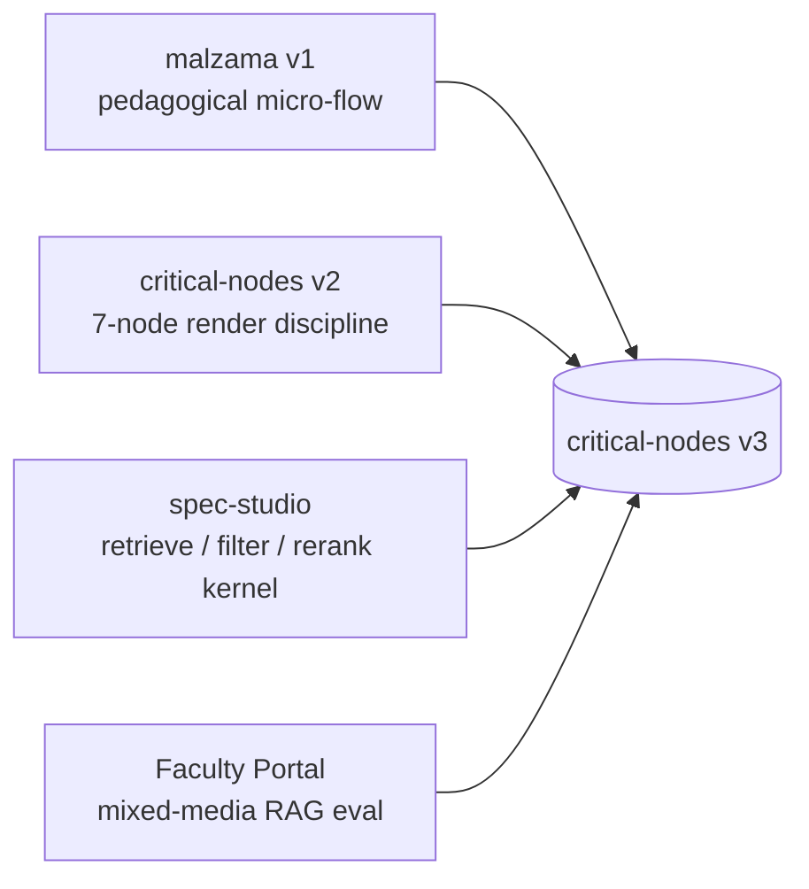
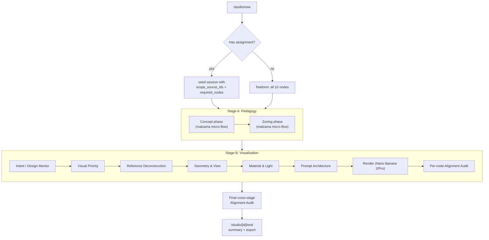
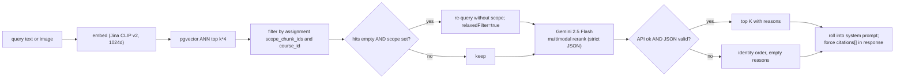
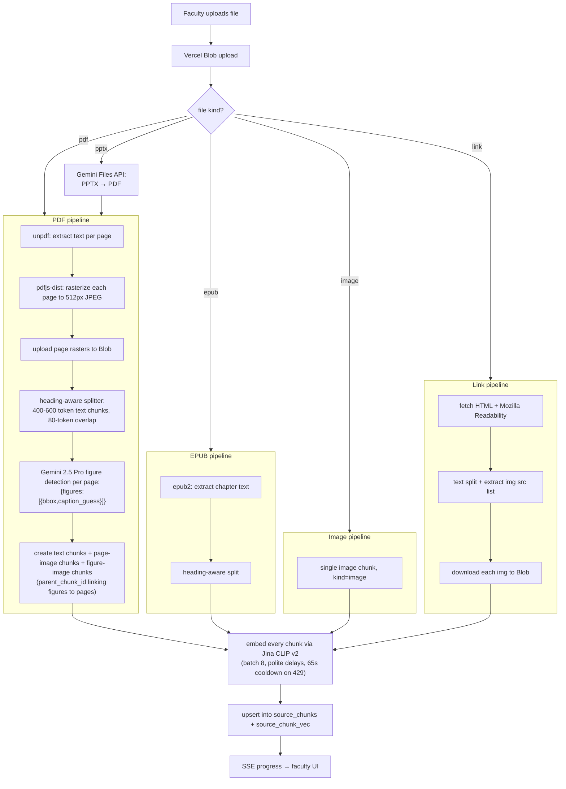

# Critical Nodes v3 — Mega Spec

> Status: design spec, pre-implementation
> Sibling docs: [`malzama-investigation.md`](malzama-investigation.md), [`spec-studio-investigation.md`](spec-studio-investigation.md)
> Target: extend the existing [`critical-nodes`](.) Next.js 16 app in place; ship to Vercel

---

## 1. Vision & guiding principles

Critical Nodes v3 is the **entire lifecycle of design for the student** — from framing the problem to producing the AI-mediated visualization, every step grounded in the faculty's own academic material, every AI moment paired with a reflective beat.

It fuses three working bodies of code:

- **malzama** (Cognitive Design Trainer) — the pedagogical micro-flow `Orient → Sketch → Think → Act → Reflect → Synthesis`, with the academic-citation + reference-visual + 1-line-insight triplet as the core teaching device. Documented in [`malzama-investigation.md`](malzama-investigation.md).
- **critical-nodes v2** — the 7-node AI-render discipline `Intent → Visual Priority → References → Geometry → Material/Light → Prompt → Audit`. Already implemented in [`src/`](src/), Gemini-wired, localStorage-only.
- **spec-studio** — the multimodal retrieve → filter → re-rank kernel (Jina CLIP v2 → sqlite-vec → Gemini 2.5 Flash with strict-JSON schema + always-on fallback). Documented in [`spec-studio-investigation.md`](spec-studio-investigation.md).

And it adds one new lineage from the recent faculty meeting:

- **Faculty Portal** — instructors upload mixed-media course material (slide decks, book excerpts with text + images). The system dissects it, embeds it, and uses it as the grounding corpus for AI question generation, mentor feedback, and student-work evaluation.

### Five non-negotiable principles

These are lifted from the two investigation docs and become hard constraints for every feature in v3:

1. **Three-stage retrieve → filter → re-rank around every AI moment.** No bare LLM call against the model's general knowledge. Spec-studio's kernel pattern is the architectural default.
2. **Strict-JSON response schemas plus always-on graceful fallback.** Every Gemini call has a `responseSchema`, every failure path returns a defined identity-or-template degradation. The student always sees results.
3. **Academic citation + visual + 1-line insight triplet.** Malzama's pedagogical signature. Every prompt the student sees is paired with the academic source it came from, a reference visual, and a one-line take-away.
4. **Reflection-first.** No AI surface stands alone. Every model-generated artifact is immediately followed by a student-reflection moment that the system stores.
5. **No `NEXT_PUBLIC_*` API keys.** Every model call routes through a server `/api/*` handler. Explicit fix to malzama's exposed `NEXT_PUBLIC_OPENAI_API_KEY` (§7 of [`malzama-investigation.md`](malzama-investigation.md)) and the discipline already followed by [`spec-studio`](../spec-studio).

---

## 2. Tech stack & deployment

| Layer | Choice | Notes |
|---|---|---|
| Framework | Next.js 16 App Router | Already pinned in [`package.json`](package.json) (`next@16.2.1`, `react@19.2.4`). |
| UI | Tailwind v4 + shadcn + Framer Motion | Already wired. Add `class-variance-authority` patterns from v2 to the new student/faculty shells. |
| DB | **Neon Postgres + `pgvector`** via Vercel Marketplace | Replaces v2's localStorage and spec-studio's SQLite. Auto-provisioned env vars (`DATABASE_URL`, `DATABASE_URL_UNPOOLED`). |
| Migrations | Drizzle ORM + `drizzle-kit` | One source of truth for schema in [`src/lib/db/schema.ts`](src/lib/db/schema.ts) → SQL migrations in `drizzle/`. |
| Files | **Vercel Blob** (`@vercel/blob`) | Faculty PDFs, slide decks, per-page rasters, student sketches, generated renders. |
| Auth | **Clerk** via Vercel Marketplace | Faculty vs student role on the JWT, middleware-gated route groups. |
| LLMs (text) | Gemini 2.5 Flash (mentor, advisory, re-rank), Gemini 2.5 Pro (audit, eval, question-gen) | `@google/genai` already installed. |
| LLMs (image) | Nano Banana 2 (`gemini-3.1-flash-image-preview`), Nano Banana Pro (`gemini-3-pro-image-preview`) | Already wired in [`src/lib/gemini.ts`](src/lib/gemini.ts). |
| Embeddings | **Jina CLIP v2** (1024d, image + text in one space) | Same pattern as [`spec-studio/lib/embed.ts`](../spec-studio/lib/embed.ts). Server-side only. |
| PDF parsing | `unpdf` for text, `pdfjs-dist` for raster, Gemini Files API for figure detection | All Vercel-friendly (no native deps). |
| Background work | Vercel Functions with `maxDuration: 300` for ingestion; optional Vercel Queues for very large PDFs | MVP can poll `ingest_status` on `sources` row. |
| Streaming | Server-Sent Events for ingestion progress | Single endpoint: `/api/ingest/[id]/stream`. |
| Rate limits | Upstash Redis via Marketplace | `/api/mentor`, `/api/render`, `/api/evaluate`. |
| Config | `vercel.ts` (typed config, replaces `vercel.json`) | Per platform guidance — see `vercel.md`. |
| Runtime | `nodejs` everywhere; **no edge** for AI routes | Fluid Compute friendly. |

### Environment variables

Server-only (never `NEXT_PUBLIC_*`):

- `DATABASE_URL`, `DATABASE_URL_UNPOOLED` — auto-provisioned by Neon Marketplace
- `BLOB_READ_WRITE_TOKEN` — auto-provisioned by Vercel Blob
- `CLERK_SECRET_KEY`, `NEXT_PUBLIC_CLERK_PUBLISHABLE_KEY` — Clerk Marketplace (publishable key is the only `NEXT_PUBLIC_` here, by design)
- `GEMINI_API_KEY` — Google AI Studio
- `JINA_API_KEY` — Jina embeddings
- `UPSTASH_REDIS_REST_URL`, `UPSTASH_REDIS_REST_TOKEN` — rate limiting
- Optional: `AI_GATEWAY_API_KEY` — if we route through Vercel AI Gateway later

---

## 3. Three lineages — what we keep, evolve, delete

This is the contract between the existing code and v3. Every row is a real, traceable design decision.

| Source feature | v3 disposition | Where it lives in v3 |
|---|---|---|
| malzama's per-phase content blob (Concept + Zoning JSON) | **KEEP, port to TS** | `src/lib/phases/concept.ts`, `src/lib/phases/zoning.ts` |
| malzama's Orient → Sketch → Think → Act → Reflect → Synthesis state machine | **KEEP** | `src/components/phases/phase-runner.tsx` |
| malzama's magic keys (97=visual recall, 98=compare, 99=driver) | **KEEP** | `session_node_state.data` jsonb |
| malzama's 1.35s response-reveal screen | **KEEP** | Existing animation tokens in [`src/app/globals.css`](src/app/globals.css) |
| malzama's `NEXT_PUBLIC_OPENAI_API_KEY` browser call | **DELETE** | Replaced by `/api/mentor` route handler |
| malzama's hardcoded academic library (Lawson, Ching, Zumthor, Pallasmaa, Lynch) | **KEEP as fallback** | `src/config/references-academic.json` — used when no faculty source is scoped |
| critical-nodes v2's 7-node store (`IntentData`, `VisualPriorityData`, …) | **KEEP, repoint persistence** | Same TypeScript shapes from [`src/lib/store.ts`](src/lib/store.ts), now backed by `session_node_state.data` jsonb instead of localStorage |
| critical-nodes v2 components (`intent-form`, `visual-priority-locator`, `reference-deconstruction`, `geometry-validation`, `materials-light-validation`, `prompt-architecture`, `alignment-audit`) | **KEEP verbatim** | [`src/components/*`](src/components/) — they bind to the same data shape, only the hook behind them changes |
| critical-nodes v2 `LivingCanvas` + `FormDrawer` | **KEEP** | [`src/components/living-canvas.tsx`](src/components/living-canvas.tsx), [`src/components/form-drawer.tsx`](src/components/form-drawer.tsx) — now nested under `/studio/[sessionId]/visualize` |
| critical-nodes v2 `useReducer` + `loadSessions/saveSessions` localStorage flow | **EVOLVE** | New `useSessionState(nodeId)` hook calling `/api/sessions/[id]/state`. v2 localStorage retained as fallback only for one-shot v2 → v3 import. |
| spec-studio's `products` + `product_vec` schema | **EVOLVE** | Becomes `source_chunks` + `source_chunk_vec` (pgvector). Same retrieve → filter → re-rank shape. |
| spec-studio's `VendorAdapter` pattern | **EVOLVE** | Becomes `SourceAdapter` (PDF, PPTX, EPUB, image, link) in `src/lib/rag/ingest/`. |
| spec-studio's strict-JSON re-rank prompt | **KEEP** | `src/lib/rag/rerank.ts` |
| spec-studio's offline smoke test | **KEEP** | `scripts/smoke-rag.ts` |
| spec-studio's `thumbnailUrl` token-aware URL rewriting | **EVOLVE** | Now applies to PDF page rasters (resize to 512px before embedding) |
| spec-studio's auto-relax-on-empty filter | **KEEP** | Re-query without `assignment.scope_chunk_ids` if scoped retrieval returns 0 hits, surface a `relaxedFilter: true` flag in the response |
| **NEW**: Faculty Portal | **CREATE** | Route group `src/app/(faculty)/*` |
| **NEW**: Assignment composer + cohort view | **CREATE** | `/faculty/courses/[id]/assignments/[id]`, `/faculty/courses/[id]/cohort` |
| **NEW**: Mixed-media ingestion (PDF + PPTX + figures) | **CREATE** | `src/lib/rag/ingest/{pdf,pptx,epub,image,link}.ts` |
| **NEW**: Auth (Clerk) | **CREATE** | [`middleware.ts`](middleware.ts) + `src/lib/auth.ts` |
| **NEW**: Final cross-stage Alignment Audit (compares Stage A intent → Stage B prompt → render) | **CREATE** | `src/components/final-alignment-audit.tsx`, `/studio/[sessionId]/audit` |

### Three-lineage fan-in



---

## 4. Routes & top-level navigation

Three route groups. Auth-gated by Clerk middleware.

### Public

- `/` — landing. If signed-in faculty → redirect to `/faculty`. If signed-in student → redirect to `/studio`. Otherwise show product copy and sign-in CTA.
- `/sign-in`, `/sign-up` — Clerk hosted screens
- `/(public)/about`, `/(public)/legal` — placeholders

### Faculty (route group `(faculty)`, role-gated)

| Path | Purpose |
|---|---|
| `/faculty` | Course list (cards). CTA "New course". |
| `/faculty/courses/new` | Create course (title, code, optional roster CSV) |
| `/faculty/courses/[id]` | Course dashboard: source count, assignment count, recent submissions |
| `/faculty/courses/[id]/sources` | Drop-zone for PDFs/PPTX/EPUB/image; ingestion progress list |
| `/faculty/courses/[id]/sources/[sourceId]` | Source viewer — page thumbnails + chunk list + checkboxes to mark "use in assignment" |
| `/faculty/courses/[id]/assignments` | Assignment list |
| `/faculty/courses/[id]/assignments/new` | Assignment composer wizard |
| `/faculty/courses/[id]/assignments/[id]` | Assignment detail + AI-generated question preview |
| `/faculty/courses/[id]/cohort` | Student × node × status matrix |
| `/faculty/courses/[id]/evaluations/[evalId]` | AI evaluation review; faculty score override |

### Student (route group `(student)`, role-gated)

| Path | Purpose |
|---|---|
| `/studio` | Session list — active + past sessions, plus invitation-pending assignments |
| `/studio/new` | Start a free-form session (no assignment) or pick an assignment |
| `/studio/[sessionId]` | Living Canvas — overview of all 10 nodes (2 phases + 7 visualization + final audit) |
| `/studio/[sessionId]/concept` | Stage A — Concept phase (malzama micro-flow) |
| `/studio/[sessionId]/zoning` | Stage A — Zoning phase (malzama micro-flow) |
| `/studio/[sessionId]/visualize` | Stage B — the v2 7-node flow, embedded |
| `/studio/[sessionId]/audit` | Final cross-stage Alignment Audit |
| `/studio/[sessionId]/end` | End summary + export |

### API

| Path | Method | Purpose |
|---|---|---|
| `/api/rag/retrieve` | POST | `{ query, courseId, sourceIds?, assignmentId?, k }` → top-K chunks |
| `/api/rag/rerank` | POST | `{ query, chunks, topK }` → re-ranked chunks with reasons |
| `/api/ingest/pdf` | POST | Multipart upload → kicks off ingestion job |
| `/api/ingest/pptx` | POST | Same, PPTX path |
| `/api/ingest/image` | POST | Single-image embed → upsert as `source_chunks` row of `kind=image` |
| `/api/ingest/[id]/stream` | GET (SSE) | Real-time progress for an ingestion job |
| `/api/mentor` | POST | `{ sessionId, nodeId, step, payload }` → grounded mentor feedback |
| `/api/render` | POST | `{ sessionId, prompt, aspect, model }` → render image, upsert into `renders` |
| `/api/evaluate` | POST | Faculty-triggered: `{ sessionId, assignmentId }` → grounded rubric eval |
| `/api/sources/[id]` | GET, DELETE | Source viewer + faculty source delete |
| `/api/sessions/[id]/state` | GET, PATCH | Read / partial-update `session_node_state` |
| `/api/sessions/[id]/export` | GET | Generate end-summary export (JSON; PDF deferred) |
| `/api/auth/role` | POST | Once-per-user role selection on first sign-up |

All API routes:

- `export const runtime = "nodejs"`
- `export const dynamic = "force-dynamic"`
- Use `auth()` from `@clerk/nextjs/server` first; 401 on miss
- Return `{ ok, data?, error?, citations? }` envelope

---

## 5. Data model (Postgres DDL)

All tables `CREATE TABLE IF NOT EXISTS` for idempotent migration. `id` is `bigserial` unless noted. All timestamps are `timestamptz`.

```sql
-- Users mirror Clerk; we don't store credentials, just role + cached display.
CREATE TABLE users (
  id          bigserial PRIMARY KEY,
  clerk_id    text NOT NULL UNIQUE,
  role        text NOT NULL CHECK (role IN ('faculty','student')),
  display_name text,
  email       text,
  created_at  timestamptz NOT NULL DEFAULT now()
);

CREATE TABLE courses (
  id          bigserial PRIMARY KEY,
  owner_id    bigint NOT NULL REFERENCES users(id),
  title       text NOT NULL,
  slug        text NOT NULL UNIQUE,
  code        text,                                  -- e.g. "ARCH-301"
  created_at  timestamptz NOT NULL DEFAULT now()
);

CREATE TABLE enrollments (
  course_id   bigint NOT NULL REFERENCES courses(id) ON DELETE CASCADE,
  student_id  bigint NOT NULL REFERENCES users(id),
  invited_at  timestamptz NOT NULL DEFAULT now(),
  joined_at   timestamptz,
  PRIMARY KEY (course_id, student_id)
);

-- One row per uploaded artifact (PDF, PPTX, EPUB, image, link).
CREATE TABLE sources (
  id            bigserial PRIMARY KEY,
  course_id     bigint NOT NULL REFERENCES courses(id) ON DELETE CASCADE,
  kind          text NOT NULL CHECK (kind IN ('pdf','pptx','epub','image','link')),
  title         text NOT NULL,
  blob_url      text NOT NULL,                       -- original file in Vercel Blob
  mime          text,
  page_count    int,
  ingest_status text NOT NULL DEFAULT 'queued'
                  CHECK (ingest_status IN ('queued','running','done','error')),
  ingest_error  text,
  ingested_at   timestamptz,
  uploaded_by   bigint NOT NULL REFERENCES users(id),
  raw_meta      jsonb,
  created_at    timestamptz NOT NULL DEFAULT now()
);

-- Generalization of spec-studio's `products` table.
-- One row per chunk produced from a source. `kind` distinguishes text/image/table.
CREATE TABLE source_chunks (
  id              bigserial PRIMARY KEY,
  source_id       bigint NOT NULL REFERENCES sources(id) ON DELETE CASCADE,
  parent_chunk_id bigint REFERENCES source_chunks(id),
  ordinal         int NOT NULL,                       -- stable order within source
  kind            text NOT NULL CHECK (kind IN ('text','image','table')),
  page            int,                                -- 1-indexed; null for non-paginated
  bbox            jsonb,                              -- {x,y,w,h} for figure/page region
  content_text    text,                               -- present for text chunks; caption for figures
  image_blob_url  text,                               -- present for image chunks
  tokens          int,                                -- approximate token count
  created_at      timestamptz NOT NULL DEFAULT now()
);

CREATE INDEX idx_source_chunks_source ON source_chunks(source_id);
CREATE INDEX idx_source_chunks_text_fts
  ON source_chunks USING gin (to_tsvector('english', coalesce(content_text,'')));

-- pgvector embeddings, 1024d (Jina CLIP v2). Cosine distance via `<=>`.
CREATE TABLE source_chunk_vec (
  chunk_id   bigint PRIMARY KEY REFERENCES source_chunks(id) ON DELETE CASCADE,
  embedding  vector(1024) NOT NULL
);

CREATE INDEX idx_source_chunk_vec_ivf
  ON source_chunk_vec USING ivfflat (embedding vector_cosine_ops)
  WITH (lists = 100);

-- Assignments: scope (which sources/chunks are in play) + rubric + which nodes are required.
CREATE TABLE assignments (
  id               bigserial PRIMARY KEY,
  course_id        bigint NOT NULL REFERENCES courses(id) ON DELETE CASCADE,
  title            text NOT NULL,
  brief            text,
  scope_source_ids bigint[] NOT NULL DEFAULT '{}',
  scope_chunk_ids  bigint[] NOT NULL DEFAULT '{}',    -- empty = all chunks of scope_source_ids
  required_nodes   text[] NOT NULL,                   -- e.g. ['concept','zoning','intent',...,'audit']
  rubric           jsonb NOT NULL DEFAULT '{}'::jsonb,
  due_at           timestamptz,
  published_at     timestamptz,
  created_at       timestamptz NOT NULL DEFAULT now()
);

-- A student's working session for an assignment (or freeform).
CREATE TABLE sessions (
  id            bigserial PRIMARY KEY,
  student_id    bigint NOT NULL REFERENCES users(id),
  course_id     bigint REFERENCES courses(id),
  assignment_id bigint REFERENCES assignments(id),
  status        text NOT NULL DEFAULT 'active'
                  CHECK (status IN ('active','submitted','evaluated','archived')),
  started_at    timestamptz NOT NULL DEFAULT now(),
  ended_at      timestamptz
);

CREATE INDEX idx_sessions_student ON sessions(student_id);

-- One row per node. `data` holds malzama-phase shape OR v2 IntentData/etc.
CREATE TABLE session_node_state (
  session_id        bigint NOT NULL REFERENCES sessions(id) ON DELETE CASCADE,
  node_id           text NOT NULL,                    -- 'concept' | 'zoning' | 'intent' | 'visualPriority' | ...
  data              jsonb NOT NULL DEFAULT '{}'::jsonb,
  mentor_feedback   jsonb,                            -- last grounded mentor message + citations
  completed_at      timestamptz,
  updated_at        timestamptz NOT NULL DEFAULT now(),
  PRIMARY KEY (session_id, node_id)
);

-- Append-only AI conversation log, with citations.
CREATE TABLE mentor_messages (
  id            bigserial PRIMARY KEY,
  session_id    bigint NOT NULL REFERENCES sessions(id) ON DELETE CASCADE,
  node_id       text NOT NULL,
  step          text,                                 -- e.g. 'reflect-q3', 'synthesis-refine'
  role          text NOT NULL CHECK (role IN ('user','assistant','system')),
  content       text NOT NULL,
  citations     jsonb NOT NULL DEFAULT '[]'::jsonb,   -- [{chunk_id, source_id, page}]
  model         text,
  prompt_tokens int,
  output_tokens int,
  ms            int,
  created_at    timestamptz NOT NULL DEFAULT now()
);

CREATE INDEX idx_mentor_session ON mentor_messages(session_id, created_at);

CREATE TABLE renders (
  id              bigserial PRIMARY KEY,
  session_id      bigint NOT NULL REFERENCES sessions(id) ON DELETE CASCADE,
  prompt          text NOT NULL,
  model           text NOT NULL,                      -- 'gemini-3.1-flash-image-preview' | 'gemini-3-pro-image-preview'
  aspect          text NOT NULL,
  blob_url        text NOT NULL,
  thumb_blob_url  text,
  created_at      timestamptz NOT NULL DEFAULT now()
);

-- Faculty-side eval against an assignment's scope.
CREATE TABLE evaluations (
  id            bigserial PRIMARY KEY,
  session_id    bigint NOT NULL REFERENCES sessions(id) ON DELETE CASCADE,
  assignment_id bigint NOT NULL REFERENCES assignments(id),
  rubric_scores jsonb NOT NULL,                       -- {[rubric_key]: {score, evidence}}
  narrative     text NOT NULL,
  citations     jsonb NOT NULL DEFAULT '[]'::jsonb,
  model         text NOT NULL,
  faculty_overrides jsonb,                            -- {[rubric_key]: score} after faculty review
  faculty_notes  text,
  created_at    timestamptz NOT NULL DEFAULT now()
);

-- Audit log for everything that mutates state.
CREATE TABLE events (
  id          bigserial PRIMARY KEY,
  actor_id    bigint REFERENCES users(id),
  kind        text NOT NULL,                          -- 'session.create', 'ingest.start', ...
  payload     jsonb NOT NULL DEFAULT '{}'::jsonb,
  created_at  timestamptz NOT NULL DEFAULT now()
);
```

### Schema mapping back to v2 and spec-studio

| v3 table | Predecessor | Migration |
|---|---|---|
| `users` + Clerk | none | new |
| `sources` + `source_chunks` + `source_chunk_vec` | spec-studio `products` + `product_vec` | identical pattern, generalized columns |
| `sessions` + `session_node_state` | v2 `Session` in [`src/lib/store.ts`](src/lib/store.ts) localStorage | one-shot import on first login |
| `mentor_messages` | malzama in-memory `aiFeedback` | persisted + cited now |
| `renders` | v2 `RenderHistoryItem` in localStorage | one-shot import |
| `assignments`, `evaluations` | none | new |

---

## 6. Student lifecycle — every screen, every branch

The student's path through v3 is a deterministic 10-node graph: 2 pedagogy phases (Stage A) + 7 visualization nodes (Stage B) + 1 final cross-stage audit. Inside each Stage A phase, the malzama micro-flow runs (6 sub-screens). Total ~18 sub-steps.

### Full lifecycle diagram



### 6.1 Stage A — Pedagogy (Concept + Zoning phases)

Each phase runs the malzama micro-flow verbatim (full details in §5 of [`malzama-investigation.md`](malzama-investigation.md)):

1. **Orient** (3 sub-screens, internal progress 33% → 66% → 100%)
   - Definition card (`conceptDefinition`)
   - Strong example card (`example` + `exampleExplanation`)
   - Academic insight card (`academic.insight`, attributed). In v3 this card prefers faculty-uploaded sources when the assignment has scoped a relevant chunk; falls back to [`src/config/references-academic.json`](src/config/references-academic.json) otherwise.
2. **Sketch** — drag-drop / paste / click upload. Stored as base64 in `session_node_state.data.userSketch` and (for size) also uploaded to Vercel Blob.
3. **Think** — dynamic question list per malzama's rule:
   - For each `questions[i]`: free-text or select grid (per `questionOptions[i]`)
   - After first select question, inject `driver` pick (magic key `99`)
   - Then inject `compare` step (magic key `98`) if `reference` + `compareQuestion` exist
   - Insight overlays for questions with non-null `questionInsights[i]` — citation now resolves through `sources` → `source_chunks` first, with the academic library as fallback
   - 1.35s response-reveal between answers
4. **Act** — two modes (per phase config):
   - **Single output**: stop-and-focus screen → 2-minute optional timer → required textarea + optional image
   - **Missions sequence**: N missions (Concept: 4 missions, 1 required; Zoning: 4 missions, all required). Each mission has reference visual + insight + task + diagram upload
5. **Reflect**:
   - Recap card (shows the act output)
   - Visual recall (side-by-side initial sketch vs. produced output) — only if sketch uploaded; answer stored under magic key `97`
   - Choice question (`reflectChoices` → Yes / Not really / Not sure)
   - Why? textarea → stitched as `"{choice} — {why}"` into `reflectAnswers[0]`
   - Remaining open `reflection[i]` questions, each with 1.35s response-reveal
   - **AI mentor feedback** — `/api/mentor` POST, grounded against scoped chunks, 1-2 sentences, fallback to null
6. **Synthesis** (Concept phase only — Zoning skips to next node):
   - Concept Statement: template-first via malzama's `H()`, then `/api/mentor` refinement (RAG-grounded) — shows `Refining…` then `AI-refined` badge on success, falls back to template on failure
   - Presentation Script: 4 fill-in-the-blank verbal lines
   - Concept Strength Check: 4 hardcoded criteria with min-char thresholds (same as malzama)
   - Spatial Translation Opportunities: keyword library + **new in v3**: RAG retrieval against scoped chunks for additional suggestions, with citations

The phase JSON content (`questions`, `questionOptions`, `thinkResponses`, `questionInsights`, `driverQuestion`, `reference`, `compareQuestion`, `action`, `missions`, `reflection`, `reflectChoices`, `reflectResponses`) is ported verbatim from §4.1 / §4.2 of [`malzama-investigation.md`](malzama-investigation.md) into TypeScript modules:

- `src/lib/phases/concept.ts`
- `src/lib/phases/zoning.ts`

Each `referenceId` in those modules first attempts to resolve against the course's `sources` (faculty-uploaded), and only falls back to the canonical academic library if nothing scoped matches.

### 6.2 Stage B — Visualization (v2 verbatim, now RAG-grounded)

The 7 nodes from [`src/lib/store.ts`](src/lib/store.ts) (`intent → visualPriority → references → geometry → materialsLight → prompt → audit`) ship unchanged. The existing components ([`src/components/intent-form.tsx`](src/components/intent-form.tsx) etc.) bind to the same data shapes (`IntentData`, `VisualPriorityData`, `ReferenceBreakdown[]`, `GeometryValidationData`, `MaterialJustification[]`, `LightingData`, `PromptFields`).

The only change is the AI advisory hook ([`src/lib/ai-advisory.ts`](src/lib/ai-advisory.ts)). Today it makes a direct Gemini call. In v3 it pre-calls the RAG kernel with the node's current text, retrieves top-K chunks from the assignment scope, then passes the chunks as grounding context to the existing Gemini call. The chunks render as a `cited n sources` chip in the UI, expanding to source titles + page numbers on hover.

Per-node AI moments and their existing v2 wiring:

| Node | v2 advisory | v3 evolution |
|---|---|---|
| `intent` (Design Mentor) | Concept Clarity Summary | RAG-grounded against scoped concept chunks |
| `visualPriority` | Sketch evaluation (multimodal) | Unchanged — about student's own image |
| `references` | Reference annotation feedback | RAG-grounded against faculty image library + scoped academic chunks |
| `geometry` | Camera validation | Unchanged — about student's 3D model |
| `materialsLight` | Material-Light interaction check | RAG-grounded against material/lighting chunks |
| `prompt` | Prompt assembly advisory | RAG-grounded against scoped style/composition chunks |
| `audit` (per-node) | Alignment scoring vs. declared intent | RAG-grounded plus citations |

Image generation (`render`) stays as-is — Nano Banana 2 / Pro, wired in [`src/lib/gemini.ts`](src/lib/gemini.ts).

### 6.3 Final cross-stage Alignment Audit

A new screen at `/studio/[sessionId]/audit`. Three-panel layout:

- **Declared intent** (left): Concept Statement + Zoning logic + chosen driver
- **Constructed prompt** (middle): the assembled prompt from node `prompt`
- **Actual render** (right): the latest render thumbnail

Below the panels, a single `Run final audit` button calls `/api/evaluate` (multimodal — sends all three plus citation context). The response renders as three grouped lists:

- `alignment[]` — what the render delivered on the declared intent (each item cites the source chunk)
- `drift[]` — where the render quietly diverged
- `contradiction[]` — direct conflicts between intent → prompt → render

Each list item links back to (a) the source chunk that established the criterion, (b) the node where the student's wording came from. This is the "study hard / think hard" payoff: the student sees every drift point traced back to a decision they made and a source they were grounded by.

---

## 7. The RAG kernel — ported & evolved from spec-studio

The pipeline is structurally identical to [`spec-studio`](../spec-studio); only the substrate changes (SQLite → Postgres, products → chunks). All five guiding principles from §1 apply.

### Module layout

```
src/lib/rag/
  db.ts                Postgres + pgvector client (Drizzle)
  embed.ts             Jina CLIP v2 client (image + text), rate-limit posture
  rerank.ts            Gemini 2.5 Flash multimodal re-rank with strict JSON
  retrieve.ts          retrieve → filter → rerank composition
  ground.ts            grounding helper: chunks → system-prompt context, citations
  types.ts             Chunk, RetrieveOptions, RankedChunk, GroundedResponse, ...
  ingest/
    pdf.ts             unpdf + pdfjs-dist + Gemini figure-detection
    pptx.ts            Gemini Files API conversion → PDF path
    epub.ts            epub2 text extraction
    image.ts           single-image embed + upsert
    link.ts            HTML fetch + Mozilla Readability
```

### Pipeline (mirrors spec-studio)



### Retrieval

`retrieveChunks(qVec, { courseId, sourceIds, assignmentId, k=24, overscan=k*4 })`:

1. SQL: `SELECT chunk_id, 1 - (embedding <=> $1) AS sim FROM source_chunk_vec ORDER BY embedding <=> $1 LIMIT $2` with `$2 = overscan`.
2. JOIN `source_chunks` + `sources` to attach `course_id`, `kind`, `page`.
3. Filter by `course_id` (always), `sources.id IN scope_source_ids` (if `assignmentId` and scope set), `source_chunks.id IN scope_chunk_ids` (if assignment narrows further).
4. Slice to `k`. If empty and any scope filter was applied, re-query without scope, set `relaxedFilter: true`.

This is the **overscan-then-filter** pattern directly from `searchByEmbedding()` in [`spec-studio/lib/db.ts`](../spec-studio/lib/db.ts).

### Hybrid retrieval (short queries)

When the query text is short (≤6 tokens), retrieval unions the vector top-K with a keyword search on `to_tsvector('english', content_text) @@ websearch_to_tsquery($query)`, de-duplicated by `chunk_id`. Empirically — and per spec-studio's experience — pure vector recall on a 3-word query is poor; FTS catches the exact-keyword case. The re-rank pass then re-orders the union.

### Re-rank prompt (strict JSON)

Lifted from [`spec-studio/lib/rerank.ts`](../spec-studio/lib/rerank.ts) with the wording adapted for documents instead of furniture:

```text
You are an academic research assistant. A student is working through a design phase
and asked the QUERY below. Below are CANDIDATE chunks from faculty-curated sources.

Evaluate each CANDIDATE on:
- direct relevance to the query (most important)
- specificity (concrete content beats general summaries)
- pedagogical value for a design student at this stage
- visual evidence quality (for image chunks)

Ignore chunks that are off-topic, redundant, or boilerplate (TOC, page numbers,
acknowledgements). Rank the remaining candidates by overall fit, best first. For
each, write a short reason (max 14 words) describing why it helps the student.

Return strict JSON:
{"ranked": [{"chunk_id": <number>, "reason": "<string>"}, ...]}.
```

Re-rank config:

- Model: `gemini-2.5-flash`
- Temperature: `0.2`
- `responseMimeType: "application/json"`
- `responseSchema`: `{ranked: [{chunk_id: number, reason: string}]}` — `responseSchema` enforced via `@google/genai` `Type.OBJECT`

**Fallback chain** (identical to spec-studio):

1. No `GEMINI_API_KEY` → identity ordering by vector similarity
2. API call throws → identity ordering
3. JSON parse fails → identity ordering
4. Empty `ranked` array → identity ordering

The user always sees results.

### Grounding (`ground.ts`)

Every AI moment that needs RAG calls `ground(systemPrompt, userPrompt, chunks)`:

```ts
async function ground(
  systemPrompt: string,
  userPrompt: string,
  chunks: RankedChunk[],
  schema: ResponseSchema,
): Promise<GroundedResponse>
```

It:

1. Appends a `CONTEXT` block to `systemPrompt` listing each chunk with its `chunk_id`, `source.title`, `page`, and content (text chunks inline; image chunks via `inlineData`).
2. Adds a hard instruction: *"Your response MUST include `citations: [chunk_id, ...]` covering exactly the chunks you actually used. Do not cite a chunk you did not use."*
3. Augments the caller's `responseSchema` with a required `citations: array<number>` field if not already present.
4. Validates that returned `citations[]` is a subset of the provided `chunks` ids; drops invalid ones with a `console.warn`.

### Always-fallback discipline

This is the single most important invariant carried over from spec-studio:

| Stage | Failure | Fallback |
|---|---|---|
| Embed query | Jina error / no key | If query is text, fall back to FTS-only; if image, surface error to user (cannot proceed) |
| ANN search | pgvector error | Return `[]`; UI shows "no matches" |
| Re-rank | any error (per §7 above) | Identity ordering, `reason: ""` |
| Ground | Gemini error | Template-only output (per AI moment, see §9), `citations: []` |

### Offline smoke test

`scripts/smoke-rag.ts` — direct port of [`spec-studio/scripts/smoke-test.ts`](../spec-studio/scripts/smoke-test.ts). Uses a temp Postgres schema (or the same Drizzle migration against a `cn_v3_smoke` database). Asserts:

1. Exact-vector seed → ranks #1 with `sim ≥ 0.99`
2. Jittered vector (eps=0.4) → in top-3
3. Scope filter holds — `assignment.scope_chunk_ids` leakage = 0
4. `rerank()` without `GEMINI_API_KEY` → identity ordering, exact count
5. `ground()` always includes `citations: number[]` (empty array on fallback path)

Runs offline with deterministic seeded random vectors. No external API needed.

---

## 8. Mixed-media ingestion — the meeting-minutes challenge

This is the central technical hard problem from the faculty meeting: *"dissect slide decks with images and text, extract meaningful information for question generation"*. We solve it with a multi-stage hybrid pipeline.

### Ingestion flow



### Per-kind details

**PDF (`ingest/pdf.ts`)**:

- Text: `unpdf` (pure JS, no native deps, Vercel-friendly) reads text per page.
- Raster: `pdfjs-dist` renders each page to a 512px-wide JPEG. The 512px choice carries over the token-cost calculus from spec-studio's `thumbnailUrl()` — Jina charges ~4k tokens per image regardless of pixel size, but the rate limit is real, so smaller is safer for ingestion-burst.
- Chunking: heading-aware splitter — break on `\n\n#` and `\n\nFigure \d+`, then re-flow to ~400-600 tokens with 80-token overlap. Tokens approximated as `len/4`.
- Figure detection: a single Gemini 2.5 Pro multimodal call per page with prompt *"Identify figures, diagrams, tables, and captioned images in this page image. Return JSON: {figures: [{bbox: {x,y,w,h}, kind: 'figure'|'diagram'|'table', caption_guess: string}]}"*. Returned figures become their own `image` chunks with `parent_chunk_id` linking to the page chunk.
- Output: one `image` chunk per page, N `text` chunks per page, M `image` chunks per figure detected. Every chunk gets embedded; every chunk gets `source_id`, `ordinal`, `page` populated.

**PPTX (`ingest/pptx.ts`)**:

- The simplest viable path: Gemini Files API accepts PPTX, returns a normalized PDF. From there we use the PDF pipeline.
- Each slide becomes one page → one `image` chunk plus zero-or-more `text` chunks for slide titles/bullets parsed by `unpdf`.
- Faculty submitting *Group_4_Concept_Diagrams.pptx* gets the same chunk structure as if they'd submitted it as PDF — uniform downstream.

**EPUB (`ingest/epub.ts`)**:

- `epub2` extracts chapter text + chapter-level metadata.
- Chunking: section-aware. No per-page raster (EPUB has no fixed pages).
- Images embedded in chapters get extracted and become `image` chunks.

**Image (`ingest/image.ts`)**:

- Single chunk of `kind=image`. Embedded directly.
- Use case: faculty drops a reference photograph or diagram standalone.

**Link (`ingest/link.ts`)**:

- Fetch HTML with the UA-spoof posture from [`spec-studio/scripts/vendors/_common.ts`](../spec-studio/scripts/vendors/_common.ts).
- Mozilla Readability extracts main article text and `` srcs.
- Each `` is fetched, uploaded to Blob, embedded.

### Ingestion concurrency

- Each ingestion job is one Vercel Function invocation, `maxDuration: 300`, `runtime: "nodejs"`.
- For PDFs >30 pages, we chunk the work into sub-jobs of ~30 pages each, all reading from the same `sources` row and incrementing `source_chunks` ordinal.
- Status reported via `sources.ingest_status` + SSE on `/api/ingest/[id]/stream`.
- Per-chunk embed posture carried from spec-studio: batches of 8, inter-batch delay 22s on free Jina tier, 65s cooldown on 429.

### Why this is robust

- **Mixed-media is solved by chunk-kind, not by trying to keep text + images glued.** Every page produces both a text chunk and an image chunk; figures within a page get their own image chunks. The downstream retrieval doesn't care — it queries the unified `source_chunk_vec`, gets back chunks of any kind, and the re-ranker decides what's relevant.
- **Image chunks are first-class.** A slide that is mostly diagram is fully searchable visually because Jina CLIP v2 puts image and text in the same 1024d space.
- **Citations always have page + bbox.** Every chunk row carries `page` and (where applicable) `bbox`. The student can click a citation chip and see exactly which page/region of which faculty source the AI grounded against.

---

## 9. AI integration — every prompt mapped

Eleven distinct AI moments across v3. Each has a row in the table below; full prompt and schema details follow.

| # | Moment | Trigger | Model | Temp | Grounded? | Fallback |
|---|---|---|---|---|---|---|
| 1 | Concept Statement refinement | end of Stage A Synthesis | Gemini 2.5 Flash | 0.5 | yes (scoped) | malzama template `H()` |
| 2 | Mentor feedback after Reflect | last reflection submitted | Gemini 2.5 Flash | 0.7 | yes (scoped) | `null` (no card) |
| 3 | Sketch evaluation | Stage A Sketch + Stage B Visual Priority | Gemini 2.5 Flash multimodal | 0.3 | no | text-only generic prompt |
| 4 | Reference Deconstruction analysis | Stage B node 3 | Gemini 2.5 Pro multimodal | 0.3 | yes (image lib + academic) | rule-based heuristic |
| 5 | Geometry validation advisory | Stage B node 4 | Gemini 2.5 Flash multimodal | 0.3 | no | identity-pass |
| 6 | Material-Light interaction check | Stage B node 5 | Gemini 2.5 Flash | 0.3 | yes (scoped) | rule-based check (existing in [`src/lib/ai-advisory.ts`](src/lib/ai-advisory.ts)) |
| 7 | Prompt Architecture suggestions | Stage B node 6 | Gemini 2.5 Flash | 0.4 | yes (scoped) | template-only |
| 8 | Render generation | Stage B node 6 confirm | Nano Banana 2 / Pro | n/a | n/a | surface error to user |
| 9 | Final cross-stage Alignment Audit | `/studio/[id]/audit` Run audit | Gemini 2.5 Pro multimodal | 0.2 | yes (scoped) | side-by-side diff only |
| 10 | Faculty: question generation | assignment composer "preview questions" | Gemini 2.5 Pro | 0.4 | yes (specific chunks) | block publish + show error |
| 11 | Faculty: assignment evaluation | manual / on submit | Gemini 2.5 Pro multimodal | 0.2 | yes (scoped) | rubric-empty + faculty manual |

All grounded calls go through `ground()` (§7) — they always carry `citations: chunk_id[]` in the response.

### Prompt #1 — Concept Statement refinement (Stage A Synthesis)

Adapted from §5.6 of [`malzama-investigation.md`](malzama-investigation.md), now grounded:

```text
You are an interior design studio mentor. A student produced this concept statement:

"{templated statement}"

Their core idea: {Q3}
Their spatial translation: {Q4}
Their design driver: {driver answer}

CONTEXT (faculty-provided):
{citation blocks}

Rewrite this as exactly 1–2 sentences. Be precise and specific.
Remove vague words. Keep it under 40 words total. No padding.
Do not start with "This project". Reflect the faculty context where it strengthens
the statement; do not force it.

Return JSON: {"statement": <string>, "citations": [chunk_id, ...]}.
```

Schema: `{statement: string, citations: number[]}`. Fallback: keep the template, set `citations: []`.

### Prompt #2 — Mentor feedback after Reflect

Adapted from §5.5:

```text
You are a studio mentor reviewing an interior design student's work.
Phase: {title}
Student's thinking: {think answers joined}
Student's output: {actText}
Student's reflection: {reflect answers joined}

CONTEXT (faculty-provided):
{citation blocks}

Give exactly 1–2 sentences of honest, direct feedback.
Be specific. No praise padding. No long explanations.

Return JSON: {"feedback": <string>, "citations": [chunk_id, ...]}.
```

Fallback: `null` (no mentor card shown — graceful degradation per §10 of malzama investigation).

### Prompt #4 — Reference Deconstruction (Stage B)

Lifted from v2's existing logic in [`src/components/reference-deconstruction.tsx`](src/components/reference-deconstruction.tsx) but multimodal-grounded against the faculty image library:

```text
You are a design critic analyzing a reference image the student has chosen.
For each borrowing category below, judge whether the student's stated borrowing
aligns with what is actually present in the image.

Student's stated borrowings: {borrowingCategories}
Student's annotations: {lens, framing, tone, grain, colorTemperature, notBorrowing, emotion}

REFERENCE IMAGE: [inline image]

CONTEXT (faculty image library + academic chunks):
{citation blocks}

Return JSON:
{
  "alignment": [{"category": <string>, "verdict": "aligned"|"weak"|"contradicted", "note": <string>}],
  "blind_spots": [<string>],
  "stronger_alternatives": [{"chunk_id": <number>, "why": <string>}],
  "citations": [<number>, ...]
}.
```

### Prompt #9 — Final cross-stage Alignment Audit

The signature v3 prompt:

```text
You are a senior design critic conducting a post-render alignment audit.

DECLARED INTENT (Stage A): {Concept Statement, Zoning logic, driver}
CONSTRUCTED PROMPT (Stage B): {assembled prompt from prompt-architecture node}
ACTUAL RENDER: [inline image]

CONTEXT (faculty-provided):
{citation blocks}

Identify, for each, the specific decision point and which side it came from
(intent / prompt / render). Cite chunk_ids where relevant.

Return strict JSON:
{
  "alignment": [{"point": <string>, "source": "intent"|"prompt"|"render", "citations": [<number>, ...]}],
  "drift":     [{"point": <string>, "source": "intent"|"prompt"|"render", "citations": [<number>, ...]}],
  "contradiction": [{"point": <string>, "source": "intent"|"prompt"|"render", "citations": [<number>, ...]}],
  "summary":   <string (≤30 words)>,
  "citations": [<number>, ...]
}.
```

### Prompt #10 — Faculty question generation

Faculty selects a chunk set → previews AI-generated questions before publishing an assignment:

```text
You are an instructor designing reflection questions for a design course.
The chunks below come from materials the instructor wants students to engage with.

CHUNKS:
{numbered chunks with kind=text|image}

Generate 6 questions split as:
- 2 select-style ("pick one of"): broad framing, helps students orient
- 2 open-ended: requires synthesis of at least two chunks
- 2 reflective: asks the student to compare the material to their own intent

For each question, identify the chunks that contain the expected evidence and
which rubric tags it exercises.

Return JSON:
{
  "questions": [{
    "kind": "select"|"open"|"reflective",
    "prompt": <string>,
    "options": [<string>, ...]?,         // present only for kind=select
    "expected_evidence": [<chunk_id>, ...],
    "rubric_tags": [<string>, ...]
  }]
}.
```

### Prompt #11 — Assignment evaluation

```text
You are evaluating a student's full design-studio session against the assignment
rubric. The rubric is below. The student's session state is below. The faculty's
scoped material is in CONTEXT.

RUBRIC: {assignment.rubric}
SESSION: {all node states, joined and labeled}

CONTEXT (scoped to this assignment):
{citation blocks}

For each rubric criterion, score 0–4 and cite the chunks the student demonstrated
engagement with. Be specific. Reflect on what is missing as much as what is present.

Return JSON:
{
  "rubric_scores": {[criterion]: {"score": 0|1|2|3|4, "evidence": <string>, "citations": [<number>, ...]}},
  "narrative": <string (3-5 sentences)>,
  "citations": [<number>, ...]
}.
```

Faculty can override scores in the evaluation review UI; overrides are stored separately in `evaluations.faculty_overrides`.

### General Gemini config

All `generateContent` calls share:

- `responseMimeType: "application/json"` (except image gen)
- `responseSchema` provided as `Type.OBJECT` literal per the `@google/genai` v1.46 surface
- Max tokens: 80 for §1, §2; 400 for §4, §6, §7; 800 for §9, §10, §11; n/a for §8
- Server-side only; routed via `/api/*`

---

## 10. Faculty portal — every screen

The faculty portal is a single role-gated route group. Aesthetically follows the existing critical-nodes design language (stone palette, Outfit + Playfair Display from [`README.md`](README.md)).

### `/faculty` — course list

Grid of course cards. Each card shows: title, code, enrollment count, source count, assignment count, last activity. CTA "New course" opens `/faculty/courses/new`.

### `/faculty/courses/new`

Three-field form: title, course code, optional roster CSV upload. On submit, redirects to the course detail page.

### `/faculty/courses/[id]` — course dashboard

- Header: title + edit + delete
- Tiles: enrollments, sources, assignments, total submissions
- Recent activity feed (last 20 `events` rows scoped to this course)
- Quick actions: "Upload material", "New assignment", "Invite student"

### `/faculty/courses/[id]/sources` — material library

- Drop-zone (multi-file PDF / PPTX / EPUB / image; optional link-paste)
- Per-source row: filename, kind icon, page count, chunk count, ingestion progress bar (SSE-driven), status pill
- Click a row → source viewer

### `/faculty/courses/[id]/sources/[sourceId]` — source viewer

Split view:

- **Left**: vertical list of page thumbnails (from `source_chunks` of `kind=image` with no `parent_chunk_id`)
- **Right**: chunk list for the selected page — text chunks excerpted, figure chunks shown as thumbnails. Each chunk has:
  - A "use in assignment" checkbox (saves into a faculty-local selection bag in URL state)
  - A "regenerate caption" button (faculty can override `content_text` for chunks that came out poorly)
- Bottom bar: "Add N selected chunks to assignment →" — jumps to assignment composer pre-loaded

### `/faculty/courses/[id]/assignments` — list

Table: title, due date, scope (N sources / M chunks), required nodes pills, # submissions, status.

### `/faculty/courses/[id]/assignments/new` — composer wizard

Three steps:

1. **Brief**: title, brief (long text), due date.
2. **Scope**: pick whole sources OR specific chunks; pick which `required_nodes` are in (defaults: all 10). The required-nodes UI is a pill grid mirroring the lifecycle from §6.
3. **Rubric + preview**: faculty writes rubric criteria (free-text + tagged criteria); clicks "Preview AI questions" → Prompt #10 runs → questions shown. Faculty can edit or regenerate.

Save as draft or publish. Published assignments appear in the matched students' `/studio` list.

### `/faculty/courses/[id]/cohort` — progress matrix

Sticky-header table:

- Rows: enrolled students
- Columns: the 10 nodes
- Cells: status pill (not started / in progress / submitted / evaluated), with `mentor_messages` count and time-since-last-touch

Click a cell → student session view (read-only).

### `/faculty/courses/[id]/evaluations/[evalId]` — evaluation review

- Top: rubric scores from Prompt #11 with citations expandable
- Middle: AI narrative
- Bottom: faculty override controls — score sliders + free-text notes. Saves into `evaluations.faculty_overrides` + `evaluations.faculty_notes`. Student sees the overridden scores, not the raw AI ones.

---

## 11. Authentication & roles

- Clerk via Vercel Marketplace — auto-provisioned `CLERK_SECRET_KEY` and `NEXT_PUBLIC_CLERK_PUBLISHABLE_KEY`. (The latter is the only `NEXT_PUBLIC_` env var in v3; it is a publishable, non-secret key by design.)
- Two roles on the JWT: `faculty`, `student`. Stored in Clerk `publicMetadata.role`. On first sign-up, the user lands on `/(public)/select-role` (faculty enters an instructor code, student is auto-classified or invited via course link).
- [`middleware.ts`](middleware.ts) gates route groups:
  - `(faculty)` → require `role === "faculty"`
  - `(student)` → require `role === "student"`
  - `(public)` and `/api/*` → open or per-handler `auth()` check
- Course invitation links: signed token in URL → on accept, `enrollments` row created.
- Every API handler starts with `const { userId } = auth(); if (!userId) return 401;` then a role check where applicable.
- Row-level scoping: every DB query takes the current user's id and scopes results. There is no "list all sessions" path that bypasses scoping.

---

## 12. Storage strategy

### Postgres (Neon)

Everything except blobs. Single database; tables as in §5. ivfflat index on `source_chunk_vec.embedding` with `lists = 100` (re-tunable as catalog grows; spec-studio's smoke test pattern proves the index swap is safe).

### Vercel Blob

- Faculty uploads: original PDF, PPTX, EPUB files
- Per-page raster JPEGs (for PDF/PPTX) — used both for the source viewer thumbnails and as `image` chunk media
- Figure images (cropped per `bbox`)
- Student sketches (Stage A sketch upload)
- Generated renders (Stage B render output)

Blob URLs stored on `sources.blob_url`, `source_chunks.image_blob_url`, `renders.blob_url`.

All blobs are private by default (`access: "private"`). The app issues signed read URLs on demand. Students and faculty only see blobs belonging to courses they're enrolled in.

### Migrations

Drizzle:

- Schema in [`src/lib/db/schema.ts`](src/lib/db/schema.ts)
- `npm run db:generate` → SQL files in `drizzle/`
- `npm run db:migrate` → applies to `DATABASE_URL`
- Smoke test (`scripts/smoke-rag.ts`) optionally targets a `cn_v3_smoke` database

---

## 13. Migration from v2 (no data loss)

v2 sessions are stored in browser localStorage by [`src/lib/store.ts`](src/lib/store.ts) (`loadSessions/saveSessions`, `loadHistory/saveHistory`). They are bound to a single device. v3 introduces server-backed sessions, but we don't want students to lose their work.

**Flow**:

1. On first login as a student, the client checks `localStorage` for v2 sessions.
2. If found, surface a single-button banner: *"Import N saved sessions from this device into your account?"*
3. On accept, the client POSTs each session to `/api/sessions/import` → server inserts:
   - One `sessions` row per v2 `Session`
   - One `session_node_state` row per node with `data` set to the v2 jsonb shape (which already matches our `node_id` keying — `IntentData` under `node_id='intent'`, etc.)
   - Render history goes into `renders`
4. On success, server returns the new session ids; client mirrors them back to localStorage as a "migration receipt" and stops auto-saving to localStorage.

The v2 shapes (`IntentData`, `VisualPriorityData`, `ReferenceBreakdown[]`, `GeometryValidationData`, `MaterialJustification[]`, `LightingData`, `PromptFields`) all become canonical for `data` in `session_node_state`. No transformation needed.

Existing v2 components keep working because they bind to those shapes via a new hook `useSessionState(nodeId)` which reads/writes through `/api/sessions/[id]/state` instead of localStorage. The component-level logic in [`src/components/intent-form.tsx`](src/components/intent-form.tsx), [`src/components/visual-priority-locator.tsx`](src/components/visual-priority-locator.tsx), [`src/components/reference-deconstruction.tsx`](src/components/reference-deconstruction.tsx), [`src/components/geometry-validation.tsx`](src/components/geometry-validation.tsx), [`src/components/materials-light-validation.tsx`](src/components/materials-light-validation.tsx), [`src/components/prompt-architecture.tsx`](src/components/prompt-architecture.tsx), [`src/components/alignment-audit.tsx`](src/components/alignment-audit.tsx) does not change.

---

## 14. Acceptance criteria & smoke tests

### Pedagogy phase smoke (Stage A)

A student can:

- Start a session against a published assignment
- Complete Concept phase end-to-end: orient → sketch → think (5 questions + driver + compare) → act (single output OR missions) → reflect (recap → visual recall → choice → why → open questions) → synthesis
- See at least one mentor feedback message in Reflect with a non-empty `citations` array pointing to a real faculty `source_chunks` row
- Refresh the browser at any point and resume from `session_node_state` (Postgres-backed; localStorage is import-only)

### Visualization smoke (Stage B)

- The existing 7 v2 nodes function end-to-end with all current sub-screens
- Each AI advisory now renders a `cited n sources` chip with chunk titles + page numbers
- Image generation still produces a render via Nano Banana 2 (and Pro on selection)

### Faculty smoke

- Faculty uploads a 20-page PDF and a 30-slide PPTX
- Both finish ingestion within 5 minutes (with the rate-limit posture from §7)
- The source viewer shows page thumbnails + extracted chunks (text + image + figures)
- Faculty composes an assignment scoped to a subset of chunks
- Faculty previews AI-generated questions (Prompt #10)
- A student enrolled in that course sees the assignment in their `/studio` list

### RAG smoke (`scripts/smoke-rag.ts`)

Five deterministic assertions (offline, no external API needed):

1. Exact-vector seeded match ranks #1 with `similarity ≥ 0.99`
2. Jittered match (eps=0.4) lands in top-3
3. `assignment.scope_chunk_ids` filter holds with **zero** leakage
4. `rerank()` with no `GEMINI_API_KEY` falls back to identity ordering and returns the exact requested count
5. `ground()` responses always include a `citations: number[]` (empty array on fallback path) — never undefined

### Auth smoke

- A signed-in faculty user gets a 403 redirect on any `/studio/*` URL
- A signed-in student gets a 403 redirect on any `/faculty/*` URL
- An unsigned-in user gets a 401 redirect to `/sign-in` for any gated route
- Direct `fetch` to `/api/sessions/[id]/state` for someone else's session returns 403

### Render reliability

- 95% of `/api/render` calls return a usable blob URL within 30s for Nano Banana 2, 90s for Pro
- Failure surfaces a structured error to the UI; no silent black box

---

## 15. Security & failure modes (what NOT to repeat)

The two predecessor projects both had failure modes; v3 corrects them explicitly.

### From malzama

- ✗ `NEXT_PUBLIC_OPENAI_API_KEY` shipped to the browser → **fixed**: every model call routes through `/api/*` server routes. The only `NEXT_PUBLIC_` key in v3 is the Clerk publishable key, which is non-secret by design.
- ✗ Zero persistence (refresh = lose everything) → **fixed**: server-backed `sessions` + `session_node_state` in Postgres.
- ✗ No export of summaries → **partially fixed**: `/api/sessions/[id]/export` emits JSON; PDF export is out-of-scope per §17.

### From spec-studio

- ✓ Always-on graceful fallback → **kept and extended**: identity-order on rerank fail, template-only on mentor fail, side-by-side-only on audit fail, FTS-only on embed-text fail.
- ✓ Strict JSON schema on every Gemini call → **kept**.
- ✓ Token-aware rate-limit posture in embeddings → **kept and extended** to PDF page rasters.
- ✓ Offline smoke test → **kept** as `scripts/smoke-rag.ts`.

### New for v3

- **Rate limits**: Upstash Redis sliding-window on `/api/mentor` (30/min/user), `/api/render` (10/min/user), `/api/evaluate` (5/min/user), `/api/ingest/*` (5/min/user). Configured in [`src/lib/rate-limit.ts`](src/lib/rate-limit.ts).
- **Upload size caps**: 12 MB images, 50 MB PDFs, 80 MB PPTX, 5 MB EPUB. MIME-checked server-side. Enforced before Blob upload.
- **Citation honesty**: response schemas require `citations: number[]`, and `ground()` post-validates that each cited chunk_id was actually in the retrieved set. Invalid citations are dropped with a warning, never silently kept.
- **Row-level scoping**: every DB query takes the user id; no broad listings. Drizzle's typed query builder makes accidental cross-tenant queries hard to write.
- **Blob privacy**: every Vercel Blob upload uses `access: "private"`. Read URLs are signed on demand, never embedded in HTML.
- **PII**: Clerk handles all user PII; we cache only `display_name` and `email` in `users`. No password storage.

---

## 16. Costs (rough)

Per-unit estimates, current pricing as of 2026-Q2:

| Unit | Cost | Notes |
|---|---|---|
| Embed one chunk (Jina CLIP v2) | ~$0.00002 | 4k tokens flat |
| Re-rank (Gemini 2.5 Flash, 8 candidates) | ~$0.001 | per query |
| Mentor moment (Gemini 2.5 Flash, ≤80 tokens out) | ~$0.001 | per Reflect end |
| Reference deconstruction (Gemini 2.5 Pro multimodal) | ~$0.02 | per ref |
| Final alignment audit (Pro multimodal) | ~$0.03 | per render |
| Faculty question generation (Pro, 6 questions) | ~$0.03 | per preview |
| Assignment evaluation (Pro multimodal) | ~$0.04 | per submission |
| Render (Nano Banana 2) | ~$0.04 | per image |
| Render (Nano Banana Pro) | ~$0.20 | per image |
| Ingest one page (text + raster + figure-detect) | ~$0.002 | dominated by Pro figure-detect |
| Postgres + Blob (Vercel hobby + Neon free) | ~$0 | at single-classroom scale |

### Per-student-per-assignment estimate

A "full lifecycle" student session (Stage A both phases + Stage B all 7 nodes + final audit + 1 render):

- ~6 mentor moments × $0.001 = $0.006
- 1 concept-statement refinement = $0.001
- 1 reference deconstruction = $0.02
- 1 material-light check = $0.001
- 1 prompt-architecture suggestion = $0.001
- 1 render (Nano 2) = $0.04
- 1 final audit (Pro) = $0.03
- 1 faculty evaluation (Pro) = $0.04
- ~10 RAG retrievals × $0.001 rerank = $0.01
- **Total: ~$0.15 per student per assignment**

A 30-student class with one assignment costs ~$4.50 in inference, plus the one-time ingestion (~$0.10 for a typical course pack).

---

## 17. Out of scope for v3

Called out explicitly so reviewers don't expect them:

- **Multi-tenant orgs**: v3 is single-org-per-deployment. SaaS multi-tenancy deferred.
- **Real-time collaboration / live cohort presence**.
- **PDF / Markdown export** of the End summary — `/api/sessions/[id]/export` emits JSON only. Reserved hooks in `events` for a Phase-2 PDF generator.
- **i18n**: English-only.
- **Mobile-first polish**: desktop-first per current critical-nodes posture. Reasonable mobile fallback for `/studio` reading view, not for canvas/upload flows.
- **Auto re-ingestion** of faculty sources on edit: one-shot ingestion per source for v3. Faculty re-uploads to refresh.
- **Faculty-configurable node sequences**: the order is fixed (`concept → zoning → 7 visualization nodes → final audit`). The assignment composer chooses *which* nodes are required in/out, not their order.
- **Branching / parallel sessions** under one assignment.
- **AI Gateway routing**: deferred — direct provider calls in v3 MVP, gateway behind a feature flag for v3.1.
- **Vercel Queues**: PDFs >30 pages are sub-job-chunked in `/api/ingest/pdf` directly; Queues considered for v3.1 if ingestion latency becomes a problem.

---

## 18. Implementation order (suggested, not contractual)

If we were to ship this — out of scope for the doc itself, but kept here as a navigational aid:

1. **Foundation** — Clerk wiring, middleware, Postgres + Drizzle migrations, role select screen.
2. **RAG kernel** — port spec-studio's three files (`embed`, `db`, `rerank`) to `src/lib/rag/`, swap SQLite for pgvector, add `retrieve.ts` + `ground.ts`, port smoke test.
3. **Ingestion** — PDF path first (covers 80% of value), then PPTX, then image/link/epub.
4. **Faculty portal MVP** — `/faculty/courses/[id]/sources` + source viewer first, then assignment composer.
5. **Student Stage B** — wrap the existing v2 components in `useSessionState`; swap the advisory call to RAG-grounded.
6. **Student Stage A** — port malzama phase JSON to TS modules, build `phase-runner` + Reflect mentor route.
7. **Final audit** — Prompt #9 + three-panel UI.
8. **Faculty evaluation** — Prompt #11 + override UI.
9. **Acceptance tests** — wire `scripts/smoke-rag.ts` and the manual smoke scripts from §14 into a CI job.

Each step is a self-contained, demoable slice.

---

## Appendix A — Quick lookup: where does each malzama piece live in v3?

| Malzama feature | v3 location |
|---|---|
| Concept phase JSON | `src/lib/phases/concept.ts` |
| Zoning phase JSON | `src/lib/phases/zoning.ts` |
| Academic library (5 books) | `src/config/references-academic.json` |
| Reference SVGs | `public/references/*.svg` (copy over) |
| Orient state machine | `src/components/phases/orient.tsx` |
| Sketch upload step | `src/components/phases/sketch.tsx` |
| Think runner (dynamic question list + driver + compare + insights) | `src/components/phases/think.tsx` |
| Act (single + missions) | `src/components/phases/act-single.tsx` + `src/components/phases/act-missions.tsx` |
| Reflect runner (recap → visual recall → choice → why → open + mentor) | `src/components/phases/reflect.tsx` |
| Synthesis (template + AI-refine + spatial ops) | `src/components/phases/synthesis.tsx` |
| 1.35s response-reveal | `src/components/phases/response-reveal.tsx` |
| Spatial-translation keyword library | `src/lib/phases/spatial-translation-keywords.ts` |
| Magic keys 97/98/99 | `session_node_state.data` jsonb |

## Appendix B — Quick lookup: where does each spec-studio piece live in v3?

| spec-studio feature | v3 location |
|---|---|
| `lib/embed.ts` (Jina CLIP v2 client) | `src/lib/rag/embed.ts` |
| `lib/rerank.ts` (Gemini multimodal re-rank) | `src/lib/rag/rerank.ts` |
| `lib/db.ts` (sqlite-vec ANN) | `src/lib/rag/db.ts` (pgvector) |
| `lib/schema.sql` (products + product_vec) | `src/lib/db/schema.ts` (sources + source_chunks + source_chunk_vec) |
| `scripts/ingest.ts` (per-vendor adapters) | `src/lib/rag/ingest/{pdf,pptx,epub,image,link}.ts` |
| `scripts/vendors/_common.ts` (HTTP utilities, retry, UA spoof) | `src/lib/rag/http.ts` |
| `scripts/smoke-test.ts` | `scripts/smoke-rag.ts` |
| `thumbnailUrl` (URL rewriting) | `src/lib/rag/thumbnail.ts` (now applies to PDF page rasters) |
| `auto-relax-on-empty` filter pattern | `src/lib/rag/retrieve.ts` |
| `overscan-then-filter (k*4)` | `src/lib/rag/retrieve.ts` |
| Strict-JSON `responseSchema` discipline | `src/lib/rag/rerank.ts` + all `/api/*` handlers |
| Identity-fallback on AI failure | `src/lib/rag/rerank.ts` + `src/lib/rag/ground.ts` |

## Appendix C — Quick lookup: critical-nodes v2 → v3

| v2 feature | v3 disposition |
|---|---|
| `src/app/page.tsx` (StudioPage) | Becomes `src/app/(student)/studio/[sessionId]/visualize/page.tsx`; the existing wrapper logic stays |
| `src/lib/store.ts` reducer + types | Types stay; reducer becomes server-side via API routes |
| `loadSessions/saveSessions/loadHistory/saveHistory` (localStorage) | Used for one-shot v2 → v3 import only |
| `LivingCanvas` + `FormDrawer` + `NodeExitSummary` | Reused as-is, nested under `/studio/[id]/visualize` |
| 7 node components | Reused as-is, advisory hooks now call `/api/mentor` (RAG-grounded) |
| `src/lib/gemini.ts` (image gen) | Reused as-is for `/api/render` |
| `src/lib/ai-advisory.ts` | Becomes a thin wrapper over `src/lib/rag/ground.ts` |
| `src/config/curated-references.json` | Merged into `src/config/references-academic.json` |

---

*End of spec. Reviewers: anything load-bearing missing? Note before §18 implementation starts.*
