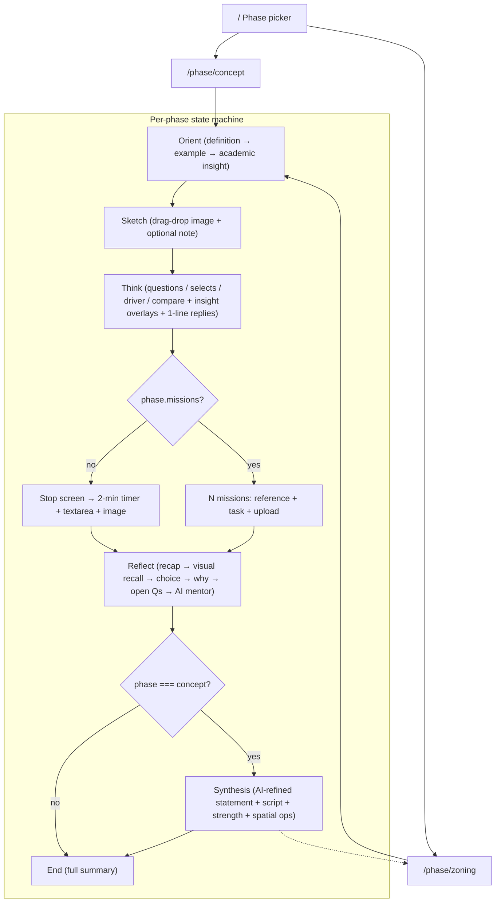

# malzama.vercel.app — Full Investigation

> Source URL: <https://malzama.vercel.app/>
> Captured: 2026-05-17
> Method: fetched HTML + every JS chunk, beautified with Prettier, reverse-engineered the React tree, state machine, data model, and AI prompts.

---

## 1. What it is

**Cognitive Design Trainer** — a single-purpose web app that walks interior-design students through a structured, reflective design workflow.

- Home tagline: *"A structured workflow tool for interior design students. Each phase guides you through thinking, producing, and reflecting."*
- Footer: *"Structured for focus. Designed for thinking."*
- The home page lists the 4 macro-stages of design (**Orient → Think → Act → Reflect**) above two clickable **Phase** cards:
  - **Concept Phase** — *Foundation* — "Define a design narrative. Frame the problem before solving it." → `/phase/concept`
  - **Zoning Phase** — *Spatial* — "Translate your concept into spatial logic. Organise zones, flow, and hierarchy." → `/phase/zoning`

That's the entire surface area. Two phases. Everything else is the inner journey.

---

## 2. Tech stack (decoded from the production build)

- **Next.js (App Router) on Vercel**, bundled with **Turbopack** — `globalThis.TURBOPACK.push(...)` chunks, `_next/static/chunks/...` paths, RSC stream in `__next_f`.
- **React Server Component shell + Client Component body.** The home page is server-rendered; `/phase/[id]` is a `ClientPageRoot` (`use(...)` for params) that hydrates a state machine.
- **Tailwind CSS** — utility-only styling, *stone* palette throughout (`stone-50` → `stone-900`), no dark mode.
- **Fonts**: Geist + Geist Mono (preloaded `.woff2` from `_next/static/media/...`).
- **No backend / no database / no auth.** All state lives in React `useState`. Refresh = lose everything.
- **AI**: direct browser `fetch` to `https://api.openai.com/v1/chat/completions` using `process.env.NEXT_PUBLIC_OPENAI_API_KEY`. Model: `gpt-4o-mini`. The `NEXT_PUBLIC_` prefix means **the key ships to the browser** — that's a real security issue to flag.
- **Images**: SVG references served from `/references/*.svg` (custom, hand-tuned diagrams in stone tones — confirmed all 6 return 200). User uploads are read as base64 (`FileReader.readAsDataURL`) and held in state — never uploaded anywhere.
- **Metadata**:
  - `<title>Cognitive Design Trainer</title>`
  - `<meta name="description" content="A structured, phase-based workflow tool for interior design students.">`

---

## 3. Routes & top-level navigation

Only 3 real routes:

- `/` — home / phase picker (RSC)
- `/phase/concept` — full 7-step state machine
- `/phase/zoning` — full 6-step state machine
- *(everything else → custom "This phase doesn't exist yet" 404)*

Steps inside a phase are **not URLs** — they're React state (`useState("orient")`). The sticky top bar renders the pill stepper:

```
concept: Orient → Sketch → Think → Act → Reflect → Synthesis → End   (7 steps)
zoning:  Orient → Sketch → Think → Act → Reflect → End               (6 steps)
```

### Top-level page state object

Threaded through every step:

```js
{
  phaseId,
  userSketch,         // base64 data URL or null
  userSketchNote,     // string
  thinkAnswers: {},   // keyed by question index, plus magic keys 98 (compare) and 99 (driver)
  actText,            // string (single-output Act mode)
  actImageUrl,        // base64 or null (single-output Act mode)
  diagramOutputs: {}, // for the Missions Act flow (keyed by mission.outputKey)
  reflectAnswers: {}, // plus magic key 97 (visual recall answer)
  aiFeedback: null,   // 1–2 sentence mentor feedback from OpenAI
}
```

---

## 4. The data model (the gold)

The entire pedagogical content lives in **one inlined JSON blob** in the bundle, keyed by `concept` and `zoning`. Same shape for both:

```ts
{
  id, title, subtitle, goal,
  conceptDefinition,                                // text shown in Orient
  academic: { source, insight },                    // book quote shown in Orient
  example, exampleExplanation,                      // "Strong example" shown in Orient
  questions: string[],                              // Think prompts (open-ended)
  questionOptions: (string[] | null)[],             // parallel array: if non-null, becomes a choice grid
  thinkResponses: string[],                         // 1-line mentor reply between Think questions
  questionInsights: (Insight | null)[],             // optional pedagogical overlay per question
  driverQuestion, driverOptions, driverResponse,    // inserted after first select Q
  reference: { image, caption, source },            // big reference diagram
  compareQuestion, compareOptions, compareResponse, // side-by-side compare-your-sketch step
  action: { instruction, description, placeholder },// Act-step copy
  missionsIntro, missions: Mission[],               // present only on phases using the multi-mission Act flow
  reflection: string[],                             // Reflect prompts
  reflectChoices: string[],                         // first reflection is a quick choice
  reflectResponses: string[],                       // 1-line mentor replies in Reflect
}
```

A `Mission` (used for both Concept's "explore your concept through multiple diagrams" and Zoning's multi-deliverable Act step):

```ts
{ id, title, required, referenceId, insight, visual, caption, task, outputKey, placeholder }
```

`Insight` (the small italic pedagogical overlay):

```ts
{ text, referenceId, visual, caption, compare: boolean }
```

### 4.1 Concept Phase — full data dump

```json
{
  "id": "concept",
  "title": "Concept Phase",
  "subtitle": "Framing the narrative",
  "goal": "Define a clear design narrative before touching form or function.",
  "conceptDefinition": "A concept is the central idea that gives your design a reason to exist. It is not about aesthetics — it is about intent. Every spatial decision should be traceable back to it.",
  "academic": {
    "source": "Bryan Lawson — How Designers Think",
    "insight": "Design begins by framing the problem, not solving it. The concept is the lens through which every decision is filtered."
  },
  "example": "A café inspired by coastal erosion — layered seating zones that gradually descend toward a central 'tide pool' lounge, with rough concrete edges softened by clusters of warm light.",
  "exampleExplanation": "Notice: the coastal erosion idea is not just a mood. It directly generates the spatial structure — the layers, the descent, the materiality. That is the difference between a concept and a theme.",
  "questions": [
    "What type of space is this project?",
    "What is the primary atmosphere this space should create?",
    "What is the single idea or metaphor at the heart of your concept?",
    "How does that idea translate into the physical space?",
    "Complete this sentence: 'This space is fundamentally about…'"
  ],
  "questionOptions": [
    ["Residential","Hospitality","Cultural","Commercial","Educational","Other"],
    ["Calm & contemplative","Energetic & social","Intimate & personal","Expansive & open","Raw & honest","Playful & unexpected"],
    null, null, null
  ],
  "thinkResponses": [
    "Good. That context shapes everything.",
    "That atmosphere is your emotional target. Hold onto it.",
    "Good. Now you have something concrete to work from.",
    "That translation is the design. Don't lose it.",
    "That sentence is your compass."
  ],
  "questionInsights": [
    null,
    null,
    { "text": "A concept is not a mood — it is a principle that generates form. Ask not what it looks like, but what logic it creates.",
      "referenceId": "zumthor-thinking-architecture",
      "visual": "/references/concept-principle.svg",
      "caption": "Concept as generative principle — from idea to spatial logic",
      "compare": false },
    { "text": "Every material, proportion, and light condition should be traceable back to the concept's inner logic.",
      "referenceId": "lawson-how-designers-think",
      "visual": "/references/concept-spatial.svg",
      "caption": "One concept — multiple spatial decisions",
      "compare": true },
    null
  ],
  "driverQuestion": "What primarily drives your concept?",
  "driverOptions": ["Emotion","Material","Narrative","User ritual"],
  "driverResponse": "That's your primary lens. It will make decisions easier.",
  "reference": {
    "image": "/references/concept-translation.svg",
    "caption": "How a concept becomes spatial structure — not decoration, but organisation.",
    "source": "Interior Design Studio — Concept Translation Diagram"
  },
  "compareQuestion": "Compared to this example, where is your concept right now?",
  "compareOptions": ["Clearly structured","Still forming","Very different direction"],
  "compareResponse": "Good. Hold that honest assessment — it's more useful than confidence.",
  "action": {
    "instruction": "Stop. Produce your concept now.",
    "description": "Sketch it, diagram it, or describe it in full. This is not a draft — commit to an idea.",
    "placeholder": "Describe your concept. What does it look like? How does it feel? What does it communicate?"
  },
  "missionsIntro": "You can explore your concept through multiple diagram types. The first is required — the rest will strengthen your idea.",
  "missions": [
    { "id": "concept-core", "title": "Concept Diagram", "required": true,
      "referenceId": "zumthor-thinking-architecture",
      "insight": "A concept diagram is not decoration — it is a spatial argument made visible. Draw the idea, not the building.",
      "visual": "/references/concept-translation.svg",
      "caption": "How a concept becomes spatial structure — from principle to organisation",
      "task": "Draw or upload a diagram that shows your concept as a spatial idea. It can be abstract — but it must communicate your core principle, not just your aesthetic.",
      "outputKey": "primary",
      "placeholder": "Describe what your concept diagram communicates (optional)" },
    { "id": "bubble", "title": "Bubble Diagram", "required": false,
      "referenceId": "ching-form-space-order",
      "insight": "A bubble diagram tests spatial relationships before committing to form. Proximity here is an argument.",
      "visual": "/references/zoning-adjacency.svg",
      "caption": "Spatial relationships — which zones need to be adjacent, buffered, or separate",
      "task": "Draw the key spaces as bubbles and show how they relate. Focus on adjacency and proximity — not shape or scale.",
      "outputKey": "bubble",
      "placeholder": "Notes on your spatial relationships (optional)" },
    { "id": "circulation", "title": "Circulation Diagram", "required": false,
      "referenceId": "lynch-image-of-the-city",
      "insight": "Circulation is the invisible architecture — the path through space gives it its meaning and rhythm.",
      "visual": "/references/zoning-journey.svg",
      "caption": "Spatial sequence — entry, movement, destination",
      "task": "Draw how a person moves through your space. Mark the entry, the main path, and the destination. What do they experience at each moment?",
      "outputKey": "circulation",
      "placeholder": "Describe the movement experience (optional)" },
    { "id": "massing", "title": "Massing / Volume Diagram", "required": false,
      "referenceId": "ching-form-space-order",
      "insight": "Volume is where concept meets construction. How does your idea translate into mass, scale, and proportion?",
      "visual": "/references/concept-principle.svg",
      "caption": "Concept as generative principle — how idea becomes form",
      "task": "Sketch or upload a simple 3D massing diagram — block volumes that communicate your concept's spatial logic. No details, no finishes.",
      "outputKey": "massing",
      "placeholder": "Describe the volume relationships (optional)" }
  ],
  "reflection": [
    "Does your concept clearly connect to your user's experience?",
    "What part of your concept is still vague or unresolved?",
    "What is the strongest element of your concept so far?",
    "If you had to reduce this to one sentence, what would it be?"
  ],
  "reflectChoices": ["Yes","Not really","Not sure"],
  "reflectResponses": [
    "Naming the gap is the first step to closing it.",
    "Build from what's working.",
    "One sentence. That's your compass."
  ]
}
```

### 4.2 Zoning Phase — full data dump

```json
{
  "id": "zoning",
  "title": "Zoning Phase",
  "subtitle": "Organising space and flow",
  "goal": "Translate your concept into spatial logic — define zones, relationships, and movement.",
  "conceptDefinition": "Zoning is how you turn an idea into inhabitable space. It is not floor plan divisions — it is the choreography of how people move, pause, and experience the space you designed.",
  "academic": {
    "source": "Francis D.K. Ching — Architecture: Form, Space & Order",
    "insight": "Zoning is not about dividing space — it is about orchestrating experience. Every boundary you draw creates a transition, and every transition communicates intention."
  },
  "example": "A library zoned not by function but by energy level — from loud collaborative zones at the entrance fading into a deep silence zone at the core, with transitional buffer spaces in between.",
  "exampleExplanation": "The organising logic here is energy, not function. That's what makes it spatial storytelling — each zone tells you something about where you are in the experience.",
  "questions": [
    "What are the primary activities this space needs to support?",
    "Which zones need to be adjacent — and which need separation?",
    "Where does the journey begin, and how does it unfold?",
    "What is the spatial hierarchy — primary, secondary, peripheral?"
  ],
  "thinkResponses": [
    "Good. Now think about where those activities conflict.",
    "Proximity reveals priority. Interesting.",
    "The journey is the design. Keep going.",
    "Hierarchy gives space its meaning."
  ],
  "questionInsights": [
    null,
    { "text": "Adjacency is not convenience — it is argument. Which spaces touch each other communicates the relationship between activities.",
      "referenceId": "ching-form-space-order",
      "visual": "/references/zoning-adjacency.svg",
      "caption": "Adjacency matrix — which zones should relate, which need separation",
      "compare": false },
    { "text": "The sequence of spaces is the experience. Entry, threshold, and core are choreographic decisions — not logistical ones.",
      "referenceId": "pallasmaa-eyes-of-the-skin",
      "visual": "/references/zoning-journey.svg",
      "caption": "Spatial sequence — from arrival to core",
      "compare": true },
    { "text": "Hierarchy determines what the eye reads first. Without hierarchy, space becomes noise.",
      "referenceId": "ching-form-space-order",
      "visual": "/references/zoning-hierarchy.svg",
      "caption": "Spatial hierarchy — primary, secondary, peripheral",
      "compare": false }
  ],
  "driverQuestion": "What primarily organises your zones?",
  "driverOptions": ["Activity type","Energy level","Privacy","User journey"],
  "driverResponse": "That logic will shape everything else.",
  "reference": {
    "image": "/references/zoning-hierarchy.svg",
    "caption": "Spatial hierarchy with primary, secondary, and quiet zones connected by circulation.",
    "source": "F.D.K. Ching — Architecture: Form, Space & Order"
  },
  "compareQuestion": "Comparing your layout to this diagram, what do you notice?",
  "compareOptions": ["Clear hierarchy","Hierarchy unclear","Different approach"],
  "compareResponse": "Good observation. Clarity of hierarchy is the first thing a critic sees.",
  "action": {
    "instruction": "Stop. Draw or describe your zoning plan now.",
    "description": "Create a bubble diagram, sketch a rough floor plan, or describe the spatial layout in detail.",
    "placeholder": "Describe your zoning layout. What zones exist? How do they connect? How does a user move through the space?"
  },
  "missions": [
    { "id": "adjacency", "title": "Adjacency Diagram", "required": true,
      "referenceId": "ching-form-space-order",
      "insight": "Adjacency is not convenience — it is argument. Which spaces touch each other communicates the relationship between activities.",
      "visual": "/references/zoning-adjacency.svg",
      "caption": "Adjacency matrix — adjacent, buffered, separated",
      "task": "Map which spaces must be adjacent, which need a transitional buffer, and which need clear separation. Use a matrix, a bubble diagram, or a sketch.",
      "outputKey": "adjacency",
      "placeholder": "Describe your adjacency logic" },
    { "id": "zones", "title": "Zoning Plan", "required": true,
      "referenceId": "ching-form-space-order",
      "insight": "Zoning is not about dividing space — it is about orchestrating experience. Every boundary is a decision.",
      "visual": "/references/zoning-hierarchy.svg",
      "caption": "Spatial hierarchy — primary, secondary, peripheral zones",
      "task": "Draw a plan showing all zones with clear boundaries. Label each zone with its primary function and energy level — loud, medium, quiet.",
      "outputKey": "zones",
      "placeholder": "Describe how your zones are organised" },
    { "id": "circulation", "title": "Circulation Diagram", "required": true,
      "referenceId": "lynch-image-of-the-city",
      "insight": "Movement is not a path between spaces — it is the experience of the design unfolding in time.",
      "visual": "/references/zoning-journey.svg",
      "caption": "Spatial sequence — entry, threshold, primary, core",
      "task": "Draw the primary circulation routes. Mark how users enter, move through, and exit. Distinguish the main path from secondary routes.",
      "outputKey": "circulation",
      "placeholder": "Describe the circulation logic" },
    { "id": "blockPlan", "title": "Block Plan", "required": true,
      "referenceId": "ching-form-space-order",
      "insight": "The block plan is where strategy becomes commitment. Every boundary you confirm is a spatial thesis.",
      "visual": "/references/concept-spatial.svg",
      "caption": "Concept → spatial decisions — confirming the design logic",
      "task": "Draw your final block plan — confirmed zones, confirmed circulation, confirmed relationships. This is your spatial thesis. Every decision counts.",
      "outputKey": "blockPlan",
      "placeholder": "Describe your final spatial decisions" }
  ],
  "reflection": [
    "Does your zoning logic support your concept narrative?",
    "Are there any conflicts or ambiguities in how zones relate?",
    "What zone feels most resolved? What needs more thinking?",
    "How does the user journey through the space tell the design story?"
  ],
  "reflectChoices": ["Yes","Not quite","Not sure"],
  "reflectResponses": [
    "Naming the conflict is the first step to resolving it.",
    "Build from what's resolved.",
    "That journey is your thesis."
  ]
}
```

### 4.3 Academic references library

Its own inlined module — used everywhere `referenceId` appears (Orient academic citation, Think insight overlays, Mission attributions).

| id | title | author | focus |
|---|---|---|---|
| `lawson-how-designers-think` | How Designers Think | Bryan Lawson | Design cognition, problem framing, and the structure of design thinking |
| `ching-form-space-order` | Architecture: Form, Space & Order | Francis D.K. Ching | Visual grammar of architecture — form, space, order, and movement |
| `zumthor-thinking-architecture` | Thinking Architecture | Peter Zumthor | The inner logic of architectural concepts and atmosphere |
| `pallasmaa-eyes-of-the-skin` | The Eyes of the Skin | Juhani Pallasmaa | Multi-sensory experience and haptic dimension of architecture |
| `lynch-image-of-the-city` | The Image of the City | Kevin Lynch | Spatial legibility, paths, edges, districts, nodes, and landmarks |

---

## 5. The full user journey — every screen, every branch

### 5.1 Orient (3 sub-screens, internal progress bar 33% → 66% → 100%)

1. **Definition** — phase title, subtitle, `conceptDefinition`. CTA: *"Show me an example →"*
2. **Strong example** — `example` in a card with a left rule, plus `exampleExplanation` ("Why it works"). CTA: *"Makes sense →"*
3. **Academic reference** — italic pull-quote of `academic.insight` with attribution. CTA: *"I'm ready to think →"*

### 5.2 Sketch

Drag-and-drop or click-to-upload (`accept="image/*"`). Optional one-line note: *"— what is this sketch about?"*. Two CTAs: *Continue to Think →* (disabled until an image exists) or *Skip for now*. The image is base64'd into state as `userSketch`.

Inline copy: *"Start with what you have."* / *"Upload a sketch, photo, or rough diagram of your current idea. It doesn't need to be finished — it just needs to exist."* / *"PNG, JPG, HEIC, PDF — any format"*.

### 5.3 Think — the most complex step

Builds a dynamic step list from the phase data. Logic (decoded from function `b()`):

- For every `questions[i]`, push either a `{kind:"question"}` (free-text textarea) or `{kind:"select"}` (option grid) based on whether `questionOptions[i]` is non-null.
- **Right after the first select question** (or after Q2 if there are no selects), inject `{kind:"driver"}` — a single-pick from `driverOptions` — and immediately after that, if `reference` + `compareQuestion` exist, inject `{kind:"compare"}` — a side-by-side of the reference diagram vs. the user's uploaded sketch with `compareOptions` to pick from.
- For each question with a `questionInsight`, an italic insight card with academic attribution renders inline. If the insight has `compare: true` and the user uploaded a sketch, the layout widens to `max-w-2xl` and shows **reference vs. your sketch** as a click-to-zoom 2-column grid.
- After every answer, a 1.35-second **response reveal** screen shows the matching `thinkResponses[i]` ("Good. That context shapes everything.") before advancing.
- Driver answer is stored under magic key `99`; compare answer under `98`.

#### Concrete Think flow for Concept phase

1. Select: *What type of space is this project?* — Residential / Hospitality / Cultural / Commercial / Educational / Other
2. Select: *What is the primary atmosphere…* — Calm & contemplative / Energetic & social / Intimate & personal / Expansive & open / Raw & honest / Playful & unexpected
3. Free text + insight overlay (Zumthor): *What is the single idea or metaphor at the heart of your concept?*
4. Free text + comparable insight overlay (Lawson): *How does that idea translate into the physical space?*
5. Free text: *Complete this sentence: "This space is fundamentally about…"*
6. Driver pick: *What primarily drives your concept?* — Emotion / Material / Narrative / User ritual
7. Compare: shown `/references/concept-translation.svg` next to user's sketch, pick *Clearly structured / Still forming / Very different direction*

### 5.4 Act — two completely different implementations

The page picks at runtime based on `phase.missions`:

#### Mode A — single output (no missions defined)

Starts with a deliberate "stop-and-focus" screen:

> # Now stop.
> Close everything else.
> This is the only thing right now.
> **[I'm ready →]**

Then the work screen:
- A **2-minute optional timer** (Start / Pause / Resume / Reset) with animated progress bar; the clock face turns muted when "Time's up".
- A **required** textarea for `action.placeholder` (auto-focus).
- An **optional** image upload area.
- CTA: *Continue to Reflect →* (disabled until text exists).

#### Mode B — Missions sequence (Concept uses it; Zoning uses it with all-required missions)

Full-bleed multi-step flow. Each mission is its own page:

- Mission counter ("Mission 2 of 4"), required/optional pill.
- Big reference visual (click → modal lightbox `p()`).
- Italic insight pulled from `references` library (cites author + book).
- The `task` prompt.
- Diagram upload area + optional notes field.
- Sticky bottom bar: ← Back | "n / total" | Skip → (optional only) | Next mission / Continue to Reflect →

Mission lists:
- **Concept**: Concept Diagram (required), Bubble Diagram, Circulation Diagram, Massing/Volume Diagram.
- **Zoning**: Adjacency Diagram, Zoning Plan, Circulation Diagram, Block Plan — *all four required*.

### 5.5 Reflect — its own micro-state-machine

Sequence (decoded from function `z()`):

1. **Recap** — *"Look at what you made."* — shows the act output (image + text) with the line *"Don't evaluate it yet. Just notice it."* CTA: *Begin reflecting →*
2. **Visual Recall** (only if a sketch was uploaded) — side-by-side of *Initial sketch* vs *What you produced*, then a focused question *"Looking at your work now, what would you change?"* (saved as `reflectAnswers[97]`).
3. **Choice** — first reflection question rendered as picks from `reflectChoices` (Yes / Not really / Not sure).
4. **Why?** — textarea follow-up that stitches together as `"{choice} — {why}"` and saves to `reflectAnswers[0]`.
5. **Open questions** — each remaining `reflection[i]` as a textarea, each followed by a 1.35s response reveal showing `reflectResponses[i-1]`. ⌘/Ctrl+Enter to submit.
6. **AI mentor feedback** (only if `NEXT_PUBLIC_OPENAI_API_KEY` is set) — spinner with *"Getting mentor feedback…"*, then POSTs to OpenAI with this exact prompt:

   ```
   You are a studio mentor reviewing an interior design student's work.
   Phase: {title}
   Student's thinking: {think answers joined}
   Student's output: {actText}
   Student's reflection: {reflect answers joined}

   Give exactly 1–2 sentences of honest, direct feedback.
   Be specific. No praise padding. No long explanations.
   ```
   `gpt-4o-mini`, `max_tokens: 80`, `temperature: 0.7`. Falls back silently to `null` on error.

### 5.6 Synthesis (concept phase only) — the most ambitious screen

Assembles five sections from the student's data.

#### 01 Concept Statement

Built locally by the template function `H()`:

*"This {space-type} project is fundamentally about {Q5}. It pursues a sense of {Q2}, expressed through {Q4}."*

Then in `useEffect`, **calls OpenAI in the background** to refine it. Prompt:

```
You are an interior design studio mentor. A student produced this concept statement:

"{templated statement}"

Their core idea: {Q3}
Their spatial translation: {Q4}
Their design driver: {driver answer}

Rewrite this as exactly 1–2 sentences. Be precise and specific.
Remove vague words. Keep it under 40 words total. No padding.
Do not start with "This project".
```
`gpt-4o-mini`, `max_tokens: 80`, `temperature: 0.5`. When it returns, a small *"AI-refined"* badge appears; while loading, a *"Refining…"* spinner shows. Falls back gracefully to the templated version.

#### 02 Presentation Script

4 fill-in-the-blank verbal lines (each "10–15 seconds"):
- *My project is about…* → `Q5 || Q3 || actText.slice(0,80)`
- *It responds to…* → `a need for {Q2 lowercase}`
- *The key idea I'm exploring is…* → `Q3`
- *This is expressed through…* → `Q4 || actText.slice(0,60)`

#### 03 Concept Strength Check

4 hardcoded criteria, each Complete/Developing based on minimum character thresholds (decoded from `W()`):

| Criterion | Source field | Min chars |
|---|---|---|
| Clear central idea | Q3 | 15 |
| Defined context | Q1 | 3 |
| Emotional / experiential intent | Q2 | 5 |
| Spatial translation | Q4 | 15 |

If fewer than 3 are Complete, an amber warning suggests returning to Think.

#### 04 Spatial Translation Opportunities

Runs `(Q3 + Q5 + actText)` through a **keyword-matching library** (`L`) of 11 keyword groups → 3 suggestions each. Falls back to 4 generic studio principles (`K`) if nothing matches.

| Trigger keywords | Suggestions |
|---|---|
| erosion, layer(s), descent, descend, strata, sediment | Descending level changes from entry to core / Layered circulation — user moves through strata / Progressive spatial compression toward the centre |
| flow, fluid, fluidity, wave, current, drift | Continuous circulation without hard stops / Visual connections maintained across zones / Gradual, curved transitions between spaces |
| tension, contrast, duality, opposing, conflict, balance | Opposing material palettes that meet at a threshold / Compression and release sequences along the main axis / Threshold moments that mark conceptual shifts |
| nature, organic, growth, botanical, natural, biophilic | Organic plan geometry that resists rigid grids / Natural material hierarchy — raw to refined / Biomorphic spatial volumes with irregular edges |
| light, shadow, dark, luminous, glow, beam | Strategic daylight control to define zones / Gradient lighting sequences guiding movement / Shadow used as a spatial boundary, not just absence of light |
| memory, nostalgia, past, history, time, archive | Layered material surfaces suggesting temporal depth / Temporal sequences — past to present along circulation / Objects and textures as mnemonic anchors |
| silence, still, quiet, calm, retreat, sanctuary | Acoustic gradients from active zones to quiet core / Visual stillness reinforced through material restraint / Buffer spaces that decompress users before arrival |
| community, social, gather, collective, shared, together | Flexible gathering configurations around a central node / Social edge conditions — seating that faces outward / Shared threshold spaces that encourage encounter |
| journey, path, sequence, narrative, story, procession | Clear spatial sequence with a defined beginning and end / Moments of pause and reveal along the route / Hierarchy of spaces that builds toward a climax |
| fragment, ruin, incomplete, trace, remnant | Exposed structural elements as conceptual artifacts / Deliberate voids and gaps in the spatial envelope / Material incompleteness as design intention |

Fallback (`K`) — generic studio principles:
- Establish a clear spatial hierarchy: primary, secondary, peripheral
- Create intentional transition moments between activity zones
- Use materiality to reinforce the concept's atmosphere
- Define circulation that supports — not fights — the concept logic

The compare self-assessment from Think (`thinkAnswers[98]`) is also surfaced here as *"Your self-assessment"*.

#### Next Phase callout

Dark stone-900 card; quotes the synthesized concept back; primary CTA *Start Zoning Phase →* linking to `/phase/zoning`; secondary *View summary* (jumps to End).

### 5.7 End

Long single-column summary view:
- Mentor feedback (if returned)
- All Think answers (skipping blanks) + driver
- Visual journey: initial sketch ↔ final output side-by-side, with notes
- All Reflect Q/A pairs
- CTA back to `/` — *"Start Another Phase"*

---

## 6. Information flow diagram



---

## 7. AI integration — exact details

There are exactly **two** OpenAI calls in the whole app. Both bypass any backend.

### Call #1 — Reflect mentor feedback

- Trigger: user submits the **last** reflection answer.
- Endpoint: `POST https://api.openai.com/v1/chat/completions`
- Model: `gpt-4o-mini`
- Auth: `Authorization: Bearer ${process.env.NEXT_PUBLIC_OPENAI_API_KEY}`
- Body: `{ messages:[{role:"user", content: <prompt above>}], max_tokens: 80, temperature: 0.7 }`
- UI: shows a spinner *"Getting mentor feedback…"* in the same step.
- Failure mode: any throw → `aiFeedback = null` and the End screen just omits the mentor section.
- If no key → call is skipped entirely.

### Call #2 — Concept Synthesis refinement

- Trigger: Synthesis screen `useEffect` on mount (only fires once, guarded by `h` state).
- Same endpoint / model / auth.
- Body: `{ messages:[{role:"user", content: <synthesis prompt>}], max_tokens: 80, temperature: 0.5 }`
- UI: shows *"Refining…"* in the section header; on success swaps the templated statement for the AI version and shows an *"AI-refined"* italic badge.
- Failure mode: keep the local template; no error surfaced.

> Security note: `NEXT_PUBLIC_OPENAI_API_KEY` ships to every browser. Any v3 must move this server-side (route handler, server action, or AI Gateway).

---

## 8. Reference image assets

All custom hand-tuned SVGs, 640×~300 viewBox, `#fafaf9` background, hand-drawn Bézier lines in stone tones, all-caps labels in `letter-spacing: 3`. Confirmed live (HTTP 200):

- `/references/concept-translation.svg` — *"CONCEPT TO SPACE TRANSLATION"*
- `/references/concept-principle.svg`
- `/references/concept-spatial.svg`
- `/references/zoning-adjacency.svg`
- `/references/zoning-hierarchy.svg` — *"SPATIAL HIERARCHY + CIRCULATION"* (entry → primary → quiet core)
- `/references/zoning-journey.svg`

Plus `/favicon.ico`.

---

## 9. Design system & UX patterns

- **Palette**: stone-only, white background. Active accents are `stone-900` (near-black). `amber-400 / 600 / 700` is the **only** secondary color, used solely for "Developing" warnings.
- **Typography**: `font-light` for almost everything; heavy use of `text-xs font-medium tracking-widest text-stone-300 uppercase` for kicker labels — editorial / paper vibe.
- **Container**: most steps cap at `max-w-md`. Comparison views and Mission pages expand to `max-w-2xl`.
- **Sticky stepper**: pill bar at top; current step gets a stone-100 pill + scaled dot; completed steps show a `✓`; `Step n of m` shown at the left on `sm+`.
- **Micro-animations**: custom CSS classes `step-enter`, `step-enter-slow`, `response-reveal`, `fade-in`. Response screens hold for **1350 ms** before advancing.
- **Inputs**:
  - Textareas auto-focus on mount (`setTimeout(…, 100)`).
  - ⌘/Ctrl + Enter submits multi-line textareas; plain Enter submits single-line *"Why?"* inputs.
  - Disabled submit button is `opacity-25 cursor-not-allowed`.
- **Image uploads**: in-browser `FileReader.readAsDataURL` → base64 data URL stored in React state. Drag-over toggles a border highlight. Modal lightbox component `p()` for click-to-zoom on any reference or user image.
- **Timer (Act mode A)**: 120 s default; Start / Pause / Resume / Reset; animated `bg-stone-400` progress; clock greys out at zero with *"Time's up"*.
- **404**: branded custom 404 — *"Phase Not Found"* / *"This phase doesn't exist yet."* / *"More phases are being added."* / **[Back to Phase Selection]**.

---

## 10. Persistence & failure modes

- **Zero persistence.** Refresh wipes everything. No `localStorage`, no `sessionStorage`, no cookies, no DB.
- **No accounts.** Single-device, single-student, single-session.
- **No export.** End summary and Synthesis sheet are render-only.
- **No analytics or telemetry** in the bundle (no GTM, no Vercel Analytics, no Sentry).
- **Offline-friendly degradation**: if the OpenAI key is missing or the call fails, the app still works end-to-end with templated content.

---

## 11. What's missing / opportunities for v3

**Strengths to preserve**
- The pedagogical structure (Orient → Sketch → Think → Act → Reflect → Synthesis → End) is the product. It maps onto Lawson / Ching / Zumthor's design-thinking framework.
- Every prompt is paired with an **academic citation + visual + 1-line insight** — that triplet is the core teaching device.
- The dual-mode Act (single output vs. mission sequence) cleanly handles both "free production" and "structured deliverables".
- The Reflect "recap → visual recall → choice → why → open" sequence is a small interaction-design gem worth preserving.
- The Synthesis page's *template-first, AI-refine-after* pattern degrades gracefully and is offline-friendly.

**Real limitations to fix in v3**
- **No persistence whatsoever** — refresh and you lose your session. No accounts. No saved projects.
- **`NEXT_PUBLIC_OPENAI_API_KEY` is exposed to the browser.** Any v3 must move AI calls behind a server route / AI Gateway.
- Only 2 phases exist. Clear room for *Materiality*, *Lighting*, *Furniture*, *Detailing*, *Documentation*, etc.
- Hardcoded English-only copy; no i18n.
- No export (PDF / image / Markdown / share-link) of the End summary or Synthesis sheet — students will want this.
- The keyword library is a 60-line lookup table — easy win to replace or augment with an AI call.
- No image processing — uploads are raw base64. No OCR, no diagramming, no AI feedback on the actual sketch.
- No multi-user / studio / instructor view — this is single-student-on-one-device only.
- No mobile-specific polish (drag-drop falls back to file-picker but layout is desktop-first `max-w-md`).
